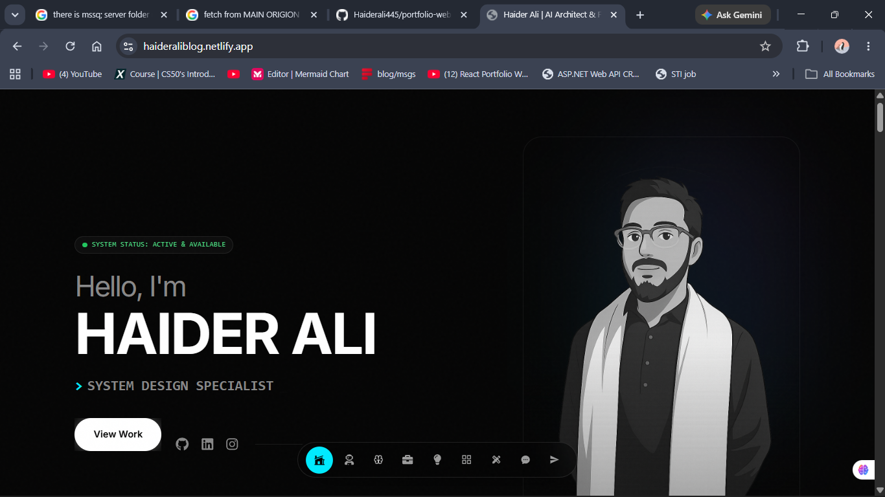
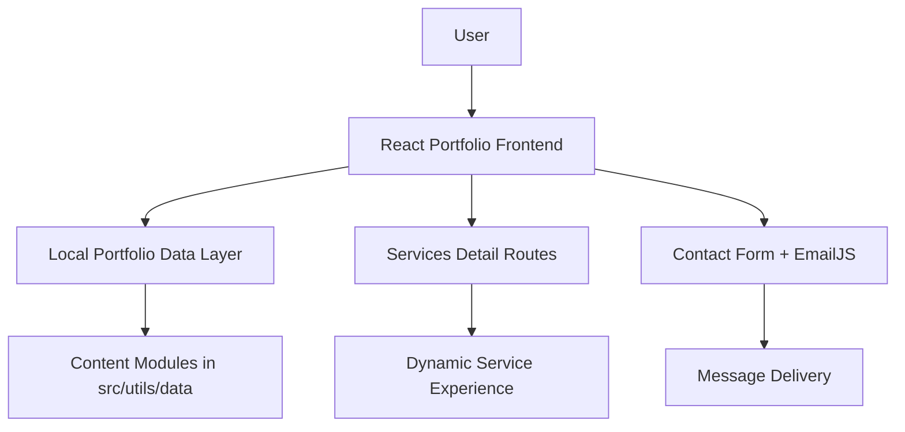
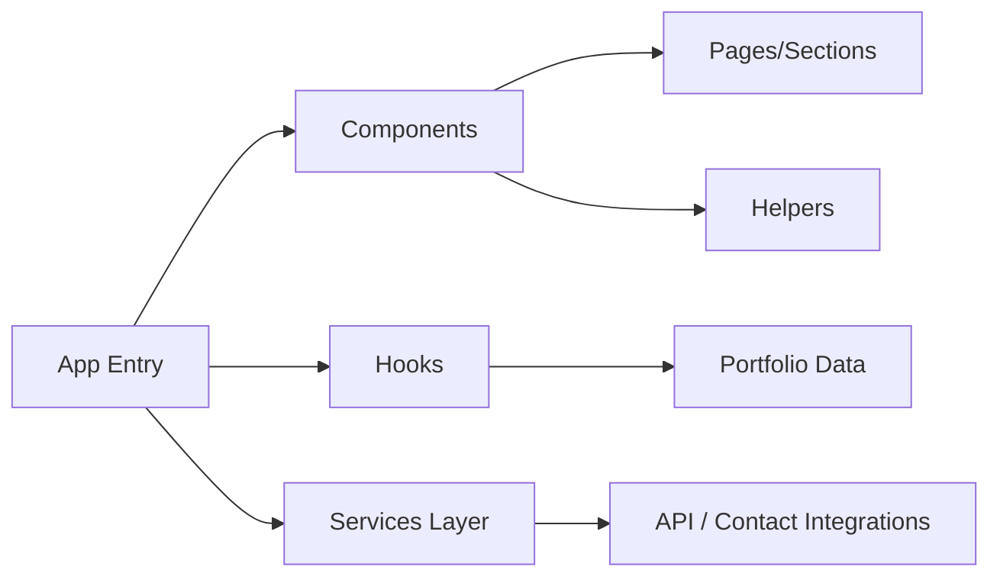
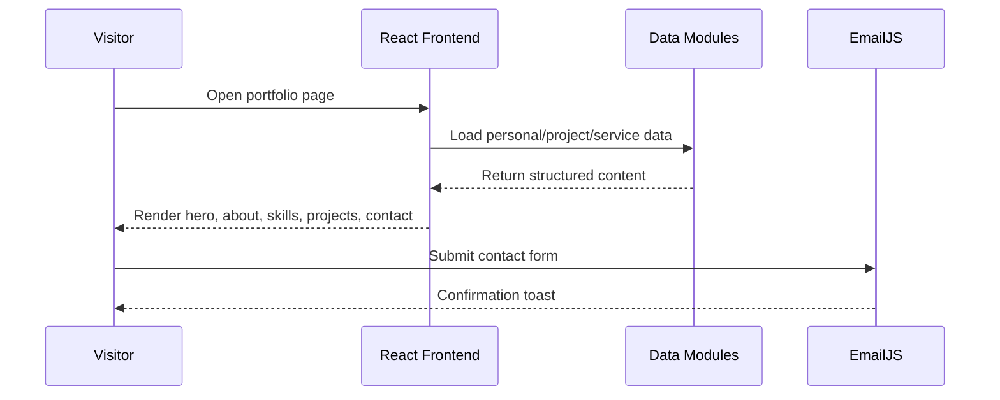
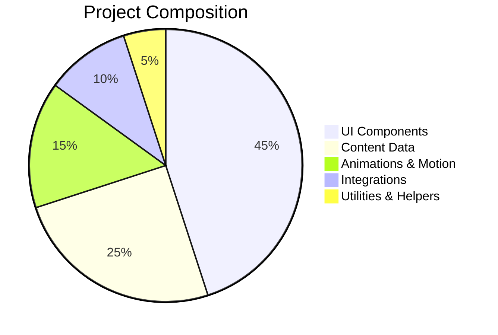

# Ego Portfolio System

> A cinematic, high-fidelity portfolio experience for a modern software engineer, built as a polished frontend layer inside a larger monorepo ecosystem.



[Live Demo](https://haideraliblog.netlify.app/) • [System Flow Docs](docs/SYSTEM_FLOW.md) • [GitHub](https://github.com/Haiderali445)

---

## Overview

This project is more than a personal website. It is a carefully crafted digital identity system that showcases engineering capability, product thinking, design sensibility, and communication clarity. The frontend is built with React and Vite, and it is structured to feel premium, responsive, and modular while staying easy to maintain.

The experience combines:
- a high-impact landing experience,
- section-based storytelling for skills, services, projects, and experience,
- animated interactions and motion design,
- reusable content data architecture,
- an API-ready foundation for future backend integration.

---

## What This System Does

The portfolio is organized around a few core experiences:

1. Hero + personal introduction
2. About and capabilities section
3. Skills and technology stack showcase
4. Experience timeline
5. Service deep-dive pages
6. Project gallery with links to code and live demos
7. Contact and social engagement

It is designed to make a strong first impression while also acting as a professional portfolio for hiring managers, collaborators, and clients.

---

## Architecture at a Glance



### Frontend Flow
- The app loads from a central hook that gathers portfolio data.
- The home screen composes all major sections from that unified dataset.
- Service pages are routed dynamically for deeper content exploration.
- Motion and UI polish are layered on top of the content structure to create a premium feel.

---

## Core Features

### Premium UI Experience
- Dark, modern visual language
- Glassmorphism-inspired cards and surfaces
- Smooth scrolling and animated transitions
- Responsive layout for desktop, tablet, and mobile

### Content Architecture
- Static content is separated into reusable data modules
- Portfolio sections are composed cleanly from structured data objects
- Service pages are routed and rendered with dedicated detail views

### Interactive Portfolio Experience
- Animated hero and section transitions
- Project cards with hover states and CTAs
- Contact form with EmailJS integration
- Social links and direct communication channels

### Future-Ready Design
- The data layer is structured in a way that can later move from local static data to an API or CMS
- The app already supports a modular expansion path for more dynamic content

---

## Tech Stack

### Frontend
- React 18
- Vite
- React Router DOM
- Tailwind CSS
- Framer Motion
- Lenis smooth scrolling
- Lottie animations
- Recharts
- Swiper
- React Hot Toast

### Integrations
- EmailJS for contact form delivery
- React Icons for UI visuals
- React Helmet Async for metadata
- AOS for scroll-based animation

---

## Project Structure

```text
apps/
  ego-web/
    src/
      App.jsx                  # App shell and route orchestration
      main.jsx                 # Entry point
      components/
        home/                  # Hero and primary landing experience
        about/
        skills/
        experience/
        projects/
        services/
        contact/
        helper/
        nav/
        footer/
      hooks/
        usePortfolioData.js    # Centralized portfolio data loader
      services/
        apiClient.js           # API integration layer
      styles/
        index.css              # Global styling and theme tokens
      utils/
        data/                  # Structured portfolio content
    docs/
      SYSTEM_FLOW.md          # System architecture overview
    package.json
    vite.config.js
    netlify.toml
```

### Visual Folder Map



### Key Areas
- src/components: UI sections and feature modules
- src/hooks: data loading and fetching logic
- src/utils/data: portfolio content source files
- src/services: service layer and API client hooks
- docs: product architecture and system flow documentation

---

## Data Model Overview

The portfolio is powered by a centralized content shape that includes:
- personal information
- skills and expertise
- experience history
- services and solutions
- projects and portfolio entries
- testimonials and contact details

This model makes the portfolio easy to evolve as your personal brand grows.

---

## System Flow



---

## Getting Started

### Clone the repository

```bash
git clone https://github.com/Haiderali445/portfolio-website.git
cd portfolio-website

### Prerequisites
- Node.js 18+
- npm or pnpm

### Install dependencies

```bash
npm install
```

### Run locally

```bash
npm run dev
```

Then open the local Vite URL shown in the terminal.

### Build for production

```bash
npm run build
```

### Quick project health chart



---

## Build & Footer Experience

The portfolio includes a polished footer section that is built from your contact information and social channels. The footer is designed to present:
- your email address,
- WhatsApp / phone contact,
- GitHub, LinkedIn, and Instagram links,
- and a clear call-to-action for collaboration.

This contact data is sourced from the central portfolio content layer so updates stay consistent across the app.

### Contact & Social Links
- Email: rajahaider7896@gmail.com
- WhatsApp: +92 322 5629058
- GitHub: https://github.com/Haiderali445
- LinkedIn: https://www.linkedin.com/in/haider-ali-8a025b290/
- Instagram: https://www.instagram.com/hayder_alyy__/

### Build Output

```bash
npm run build
```

This produces the production-ready static bundle for deployment on Netlify or a similar host.

---

## Deployment

This app is designed to be deployed easily on Netlify or similar static hosting platforms.

The repository includes:
- [netlify.toml](netlify.toml) for Netlify routing and build configuration
- a standard Vite production build flow through npm run build

---

## Documentation

For a broader view of the overall system architecture and future integration plan, see:
- [docs/SYSTEM_FLOW.md](docs/SYSTEM_FLOW.md)

This document explains how the portfolio frontend fits into a larger ecosystem involving admin dashboards, backend services, and data storage.

---

## Why This Project Stands Out

This portfolio is built with intention:
- it feels premium and modern,
- it communicates technical depth clearly,
- it is modular and scalable,
- and it is ready to grow from a personal website into a larger product platform.

It is not just a static page. It is a compact system for personal branding, professional storytelling, and future expansion.

---

## Links

- Live Site: https://haideraliblog.netlify.app/
- GitHub: https://github.com/Haiderali445
- LinkedIn: https://www.linkedin.com/in/haider-ali-8a025b290/
- Instagram: https://www.instagram.com/hayder_alyy__/
- Email: rajahaider7896@gmail.com

---

## License

This project is licensed under the MIT License.

Copyright (c) 2026 Haider Ali

Permission is hereby granted, free of charge, to any person obtaining a copy
of this software and associated documentation files (the "Software"), to deal
in the Software without restriction, including without limitation the rights
to use, copy, modify, merge, publish, distribute, sublicense, and/or sell
copies of the Software, and to permit persons to whom the Software is
furnished to do so, subject to the following conditions:

The above copyright notice and this permission notice shall be included in all
copies or substantial portions of the Software.

THE SOFTWARE IS PROVIDED "AS IS", WITHOUT WARRANTY OF ANY KIND, EXPRESS OR
IMPLIED, INCLUDING BUT NOT LIMITED TO THE WARRANTIES OF MERCHANTABILITY,
FITNESS FOR A PARTICULAR PURPOSE AND NONINFRINGEMENT. IN NO EVENT SHALL THE
AUTHORS OR COPYRIGHT HOLDERS BE LIABLE FOR ANY CLAIM, DAMAGES OR OTHER
LIABILITY, WHETHER IN AN ACTION OF CONTRACT, TORT OR OTHERWISE, ARISING FROM,
OUT OF OR IN CONNECTION WITH THE SOFTWARE OR THE USE OR OTHER DEALINGS IN THE
SOFTWARE.


