# ⚡ Ego Web

> **Production-grade cinematic portfolio** — an interactive engineering showcase built with strict architecture, not a template.

<div align="center">


</div>

> [!IMPORTANT]
> This repository is **closed for public contributions**. You may fork, clone, customize, and self-host for personal use or inspiration.

---

## 🧭 What This Is

Ego Web is a personal portfolio engineered as a production-grade frontend system. It demonstrates not just **what** the engineer has built, but **how** they think about software systems.

Key engineering decisions driving the project:

- **3-tier frontend architecture** — Presentation → Service → Data, strictly enforced with no layer bypassing
- **Supabase-backed data layer with graceful fallback** — Live cloud database querying via `BaseRepository` with seamless offline/mock data fallback
- **Normalized domain services** — 11 content domains, each isolated, independently composable, and queryable
- **Sandboxed code playground & mini-IDE** — In-browser JavaScript runtime inside an isolated iframe sandbox with live console interception
- **Interactive command terminal** — Guest/root session model, masked authentication, and protected system commands
- **Performance monitoring & logger** — Custom Morgan-style colored logger tracking request response times and status codes

---

## 🎯 Core Experiences

| # | Section | Description |
|---|---------|-------------|
| 1 | 🏠 Hero | Personal introduction with animated typewriter titles |
| 2 | 👤 About | Biography, dual-mode JSON inspector & live sandboxed JS playground, and engineering perspectives |
| 3 | 🛠️ Skills | Full technology stack and categorized skill matrix |
| 4 | 💼 Experience | Interactive timeline of roles and contributions |
| 5 | 🎓 Education | Academic and certification history |
| 6 | 🧩 Services | Service catalog with investment tiers and individual detail pages |
| 7 | 🗂️ Projects | Asymmetrical bento grid with dynamic GitHub avatars and magnetic physics hover buttons |
| 8 | 🖥️ Terminal | Interactive Linux-inspired developer interface toggled via `Ctrl + \`` |
| 9 | 📬 Contact | Validated form with EmailJS delivery and toast feedback |
| 10 | 📏 Scroll Bar | Fixed gradient reading progress tracker reflecting page depth |
| 11 | 🔎 SEO | Route-level metadata via React Helmet Async |
| 12 | 📱 Responsive | Full layout support from mobile to wide desktop |
| 13 | ♿ Accessible | Keyboard nav, ARIA, visible focus, reduced-motion support |

---

## 🏗️ Architecture

### Three-Tier System

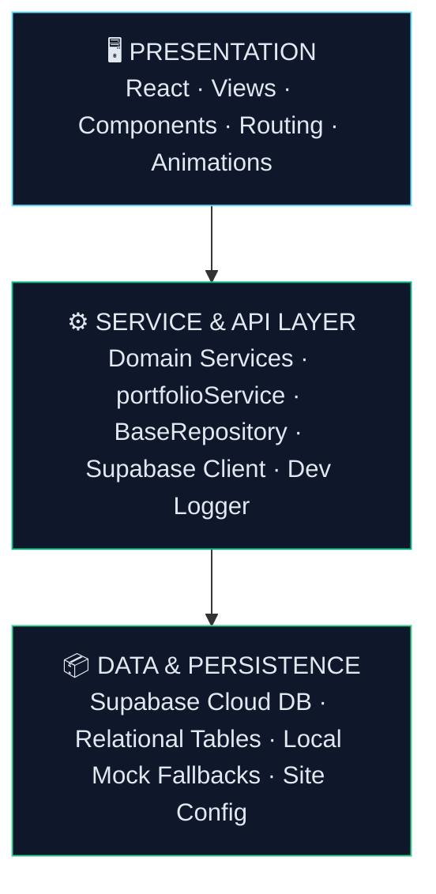
```mermaid
flowchart TD
    P["🖥️ PRESENTATION\nReact · Views · Components · Routing · Animations"]
    S["⚙️ SERVICE & API LAYER\nDomain Services · portfolioService · BaseRepository · Supabase Client · Dev Logger"]
    D["📦 DATA & PERSISTENCE\nSupabase Cloud DB · Relational Tables · Local Mock Fallbacks · Site Config"]

    P --> S --> D

    style P fill:#0f172a,stroke:#61DAFB,color:#e2e8f0
    style S fill:#0f172a,stroke:#10B981,color:#e2e8f0
    style D fill:#0f172a,stroke:#3ECF8E,color:#e2e8f0
```

**Core rule:** UI components must never access raw data or databases directly. All data flows strictly through domain services and repository abstractions.

---

### The Helper Layer

The helper layer provides interactive subsystems, developer utilities, and systemic UI feedback without violating the 3-tier boundary:

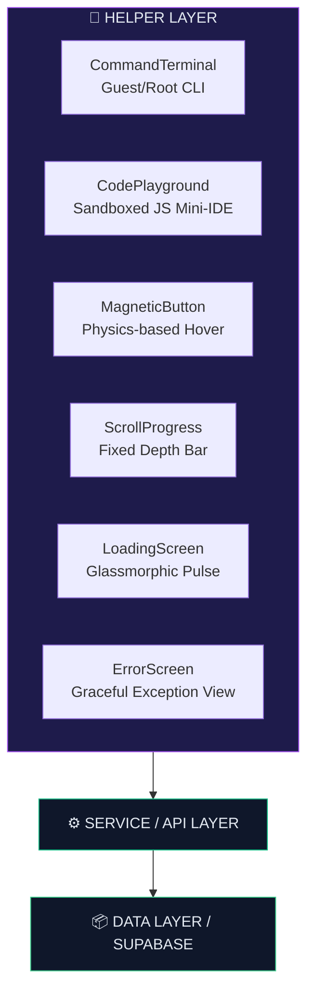
```mermaid
flowchart TD
    subgraph Helpers ["🧰 HELPER LAYER"]
        CT["CommandTerminal\nGuest/Root CLI"]
        CP["CodePlayground\nSandboxed JS Mini-IDE"]
        MB["MagneticButton\nPhysics-based Hover"]
        SP["ScrollProgress\nFixed Depth Bar"]
        LS["LoadingScreen\nGlassmorphic Pulse"]
        ES["ErrorScreen\nGraceful Exception View"]
    end

    SVC["⚙️ SERVICE / API LAYER"]
    DATA["📦 DATA LAYER / SUPABASE"]

    Helpers --> SVC --> DATA

    style Helpers fill:#1e1b4b,stroke:#a855f7,color:#e2e8f0
    style SVC fill:#0f172a,stroke:#10B981,color:#e2e8f0
    style DATA fill:#0f172a,stroke:#3ECF8E,color:#e2e8f0
```

| Helper Component | File | Architectural Role |
| :--- | :--- | :--- |
| **Command Terminal** | `CommandTerminal.jsx` | Floating developer terminal with session auth, command history, and CLI tooling |
| **Code Playground** | `CodePlayground.jsx` | Isolated iframe JavaScript runner with console interception and `developerData` binding |
| **Magnetic Button** | `MagneticButton.jsx` | Framer Motion spring physics cursor attraction with radial ambient glow |
| **Scroll Progress** | `ScrollProgress.jsx` | Fixed top viewport progress tracker calculating dynamic document scroll depth |
| **Loading Screen** | `LoadingScreen.jsx` | Initial app hydration and database query state indicator |
| **Error Screen** | `ErrorScreen.jsx` | System-wide failure boundary if portfolio resolution fails |

---

### Layered Architecture & Execution Pipeline

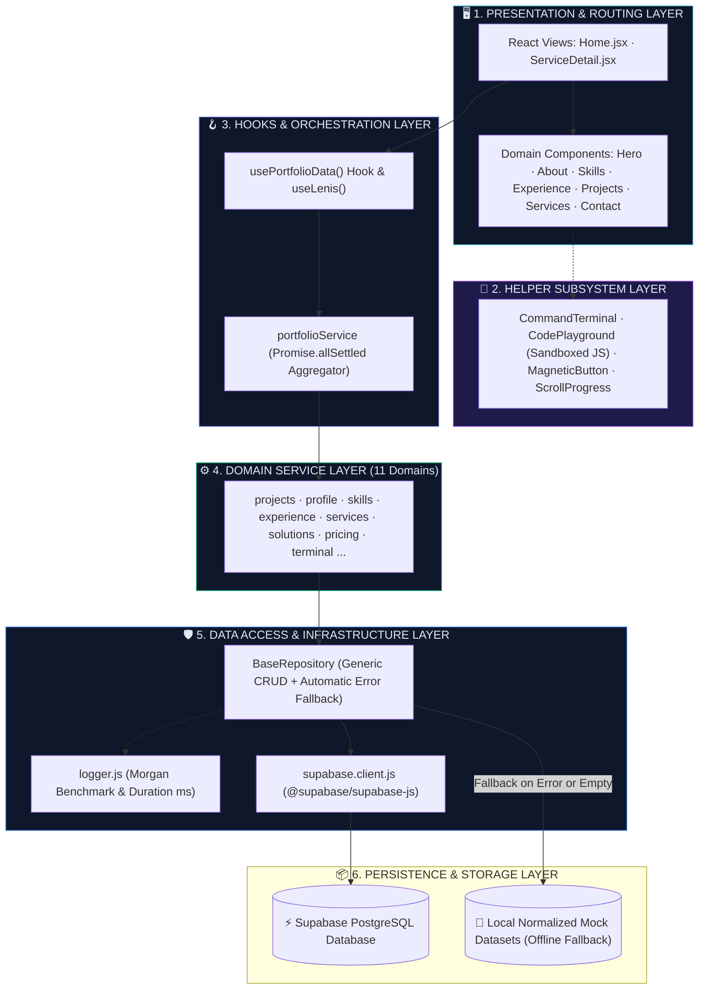
```mermaid
flowchart TD
    subgraph L1 ["🖥️ 1. PRESENTATION & ROUTING LAYER"]
        direction TB
        UI["React Views: Home.jsx · ServiceDetail.jsx"]
        COMPS["Domain Components: Hero · About · Skills · Experience · Projects · Services · Contact"]
    end

    subgraph L2 ["🧰 2. HELPER SUBSYSTEM LAYER"]
        direction TB
        HELPERS["CommandTerminal · CodePlayground (Sandboxed JS) · MagneticButton · ScrollProgress"]
    end

    subgraph L3 ["🪝 3. HOOKS & ORCHESTRATION LAYER"]
        direction TB
        HOOK["usePortfolioData() Hook & useLenis()"]
        PSVC["portfolioService (Promise.allSettled Aggregator)"]
    end

    subgraph L4 ["⚙️ 4. DOMAIN SERVICE LAYER (11 Domains)"]
        direction TB
        DS["projects · profile · skills · experience · services · solutions · pricing · terminal ..."]
    end

    subgraph L5 ["🛡️ 5. DATA ACCESS & INFRASTRUCTURE LAYER"]
        direction TB
        REPO["BaseRepository (Generic CRUD + Automatic Error Fallback)"]
        LOG["logger.js (Morgan Benchmark & Duration ms)"]
        CLIENT["supabase.client.js (@supabase/supabase-js)"]
    end

    subgraph L6 ["📦 6. PERSISTENCE & STORAGE LAYER"]
        direction TB
        DB[("⚡ Supabase PostgreSQL Database")]
        MOCK[("📁 Local Normalized Mock Datasets (Offline Fallback)")]
    end

    UI --> COMPS
    COMPS -.-> HELPERS
    UI --> HOOK
    HOOK --> PSVC
    PSVC --> DS
    DS --> REPO
    REPO --> CLIENT --> DB
    REPO -->|"Fallback on Error or Empty"| MOCK
    REPO -.-> LOG

    style L1 fill:#0f172a,stroke:#61DAFB,color:#e2e8f0
    style L2 fill:#1e1b4b,stroke:#a855f7,color:#e2e8f0
    style L3 fill:#0f172a,stroke:#818cf8,color:#e2e8f0
    style L4 fill:#0f172a,stroke:#10B981,color:#e2e8f0
    style L5 fill:#0f172a,stroke:#3b82f6,color:#e2e8f0
```

---

## 📦 Data & Database Architecture

The data layer is organized into **domain clusters** with foreign key constraints, cascading deletions (`ON DELETE CASCADE`), automated `updated_at` triggers, and performance B-Tree indexes.

### 🏛️ High-Level Domain Relationships

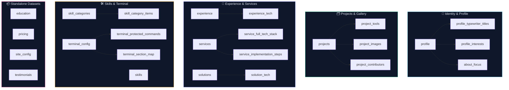
```mermaid
flowchart TD
    subgraph ProfileCluster ["👤 Identity & Profile"]
        PROFILE["profile"] --> TITLES["profile_typewriter_titles"]
        PROFILE --> INTERESTS["profile_interests"]
        PROFILE --> FOCUS["about_focus"]
    end

    subgraph ProjectsCluster ["🗂️ Projects & Gallery"]
        PROJECTS["projects"] --> TOOLS["project_tools"]
        PROJECTS --> IMGS["project_images"]
        PROJECTS --> CONTRIBS["project_contributors"]
    end

    subgraph CareerCluster ["💼 Experience & Services"]
        EXP["experience"] --> EXP_TECH["experience_tech"]
        SERV["services"] --> SERV_STACK["service_full_tech_stack"]
        SERV --> SERV_STEPS["service_implementation_steps"]
        SOL["solutions"] --> SOL_TECH["solution_tech"]
    end

    subgraph SkillsTerminalCluster ["🛠️ Skills & Terminal"]
        SKILL_CAT["skill_categories"] --> SKILL_ITEMS["skill_category_items"]
        SKILLS["skills"]
        TERM_CFG["terminal_config"] --> TERM_CMDS["terminal_protected_commands"]
        TERM_CFG --> TERM_MAP["terminal_section_map"]
    end

    subgraph StandaloneCluster ["📦 Standalone Datasets"]
        EDU["education"]
        PRICING["pricing"]
        SITE["site_config"]
        TESTIMONIALS["testimonials"]
    end

    style ProfileCluster fill:#0f172a,stroke:#61DAFB,color:#e2e8f0
    style ProjectsCluster fill:#0f172a,stroke:#10B981,color:#e2e8f0
    style CareerCluster fill:#0f172a,stroke:#818cf8,color:#e2e8f0
    style SkillsTerminalCluster fill:#0f172a,stroke:#F59E0B,color:#e2e8f0
    style StandaloneCluster fill:#0f172a,stroke:#EC4899,color:#e2e8f0
```

---

### 1️⃣ Identity & Profile Cluster ERD

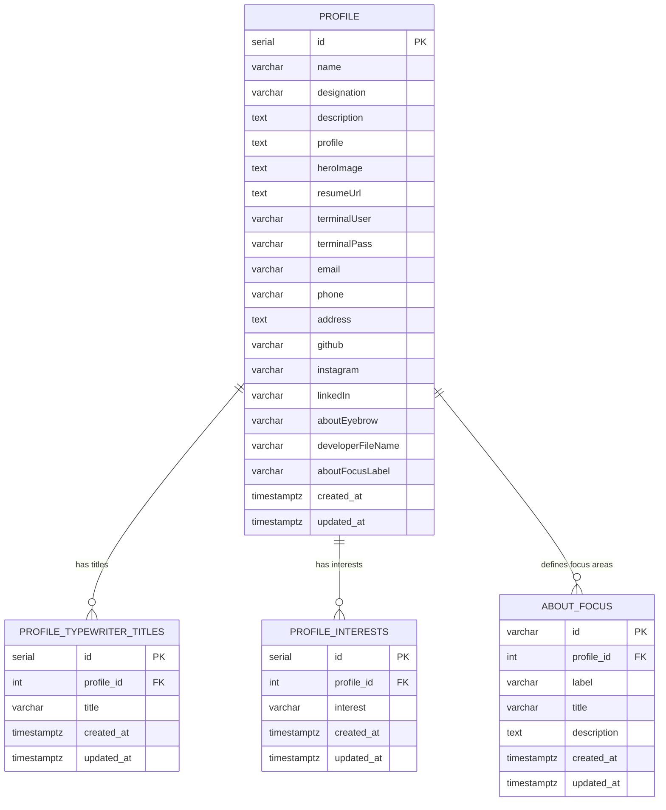
```mermaid
erDiagram
    PROFILE ||--o{ PROFILE_TYPEWRITER_TITLES : "has titles"
    PROFILE ||--o{ PROFILE_INTERESTS : "has interests"
    PROFILE ||--o{ ABOUT_FOCUS : "defines focus areas"

    PROFILE {
        serial id PK
        varchar name
        varchar designation
        text description
        text profile
        text heroImage
        text resumeUrl
        varchar terminalUser
        varchar terminalPass
        varchar email
        varchar phone
        text address
        varchar github
        varchar instagram
        varchar linkedIn
        varchar aboutEyebrow
        varchar developerFileName
        varchar aboutFocusLabel
        timestamptz created_at
        timestamptz updated_at
    }

    PROFILE_TYPEWRITER_TITLES {
        serial id PK
        int profile_id FK
        varchar title
        timestamptz created_at
        timestamptz updated_at
    }

    PROFILE_INTERESTS {
        serial id PK
        int profile_id FK
        varchar interest
        timestamptz created_at
        timestamptz updated_at
    }

    ABOUT_FOCUS {
        varchar id PK
        int profile_id FK
        varchar label
        varchar title
        text description
        timestamptz created_at
        timestamptz updated_at
    }
```

---

### 2️⃣ Projects & Gallery Cluster ERD

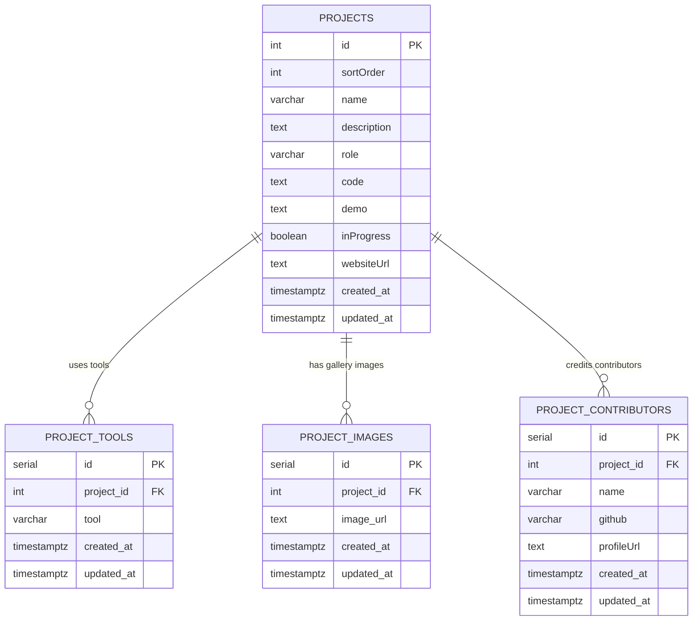
```mermaid
erDiagram
    PROJECTS ||--o{ PROJECT_TOOLS : "uses tools"
    PROJECTS ||--o{ PROJECT_IMAGES : "has gallery images"
    PROJECTS ||--o{ PROJECT_CONTRIBUTORS : "credits contributors"

    PROJECTS {
        int id PK
        int sortOrder
        varchar name
        text description
        varchar role
        text code
        text demo
        boolean inProgress
        text websiteUrl
        timestamptz created_at
        timestamptz updated_at
    }

    PROJECT_TOOLS {
        serial id PK
        int project_id FK
        varchar tool
        timestamptz created_at
        timestamptz updated_at
    }

    PROJECT_IMAGES {
        serial id PK
        int project_id FK
        text image_url
        timestamptz created_at
        timestamptz updated_at
    }

    PROJECT_CONTRIBUTORS {
        serial id PK
        int project_id FK
        varchar name
        varchar github
        text profileUrl
        timestamptz created_at
        timestamptz updated_at
    }
```

---

### 3️⃣ Experience, Services & Solutions Cluster ERD

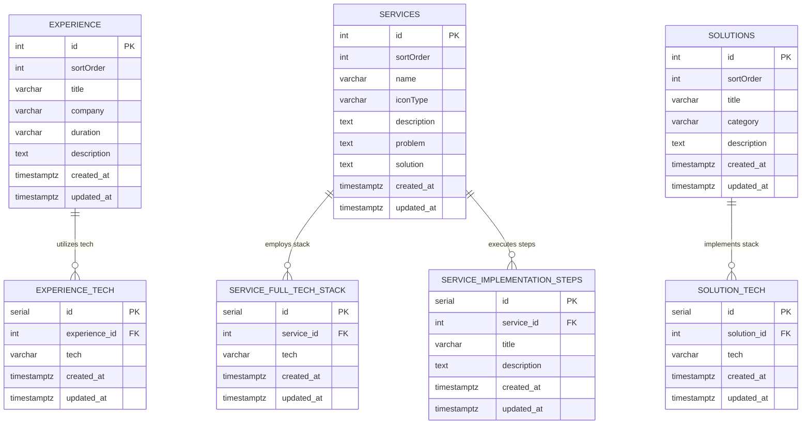
```mermaid
erDiagram
    EXPERIENCE ||--o{ EXPERIENCE_TECH : "utilizes tech"
    SERVICES ||--o{ SERVICE_FULL_TECH_STACK : "employs stack"
    SERVICES ||--o{ SERVICE_IMPLEMENTATION_STEPS : "executes steps"
    SOLUTIONS ||--o{ SOLUTION_TECH : "implements stack"

    EXPERIENCE {
        int id PK
        int sortOrder
        varchar title
        varchar company
        varchar duration
        text description
        timestamptz created_at
        timestamptz updated_at
    }

    EXPERIENCE_TECH {
        serial id PK
        int experience_id FK
        varchar tech
        timestamptz created_at
        timestamptz updated_at
    }

    SERVICES {
        int id PK
        int sortOrder
        varchar name
        varchar iconType
        text description
        text problem
        text solution
        timestamptz created_at
        timestamptz updated_at
    }

    SERVICE_FULL_TECH_STACK {
        serial id PK
        int service_id FK
        varchar tech
        timestamptz created_at
        timestamptz updated_at
    }

    SERVICE_IMPLEMENTATION_STEPS {
        serial id PK
        int service_id FK
        varchar title
        text description
        timestamptz created_at
        timestamptz updated_at
    }

    SOLUTIONS {
        int id PK
        int sortOrder
        varchar title
        varchar category
        text description
        timestamptz created_at
        timestamptz updated_at
    }

    SOLUTION_TECH {
        serial id PK
        int solution_id FK
        varchar tech
        timestamptz created_at
        timestamptz updated_at
    }
```

---

### 4️⃣ Skills Taxonomy & Terminal CLI ERD

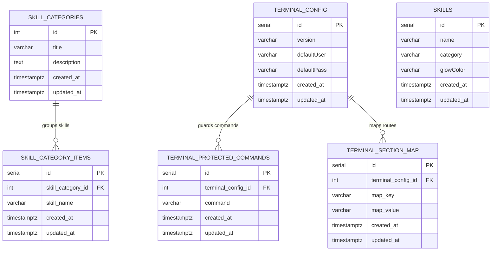
```mermaid
erDiagram
    SKILL_CATEGORIES ||--o{ SKILL_CATEGORY_ITEMS : "groups skills"
    TERMINAL_CONFIG ||--o{ TERMINAL_PROTECTED_COMMANDS : "guards commands"
    TERMINAL_CONFIG ||--o{ TERMINAL_SECTION_MAP : "maps routes"

    SKILL_CATEGORIES {
        int id PK
        varchar title
        text description
        timestamptz created_at
        timestamptz updated_at
    }

    SKILL_CATEGORY_ITEMS {
        serial id PK
        int skill_category_id FK
        varchar skill_name
        timestamptz created_at
        timestamptz updated_at
    }

    SKILLS {
        serial id PK
        varchar name
        varchar category
        varchar glowColor
        timestamptz created_at
        timestamptz updated_at
    }

    TERMINAL_CONFIG {
        serial id PK
        varchar version
        varchar defaultUser
        varchar defaultPass
        timestamptz created_at
        timestamptz updated_at
    }

    TERMINAL_PROTECTED_COMMANDS {
        serial id PK
        int terminal_config_id FK
        varchar command
        timestamptz created_at
        timestamptz updated_at
    }

    TERMINAL_SECTION_MAP {
        serial id PK
        int terminal_config_id FK
        varchar map_key
        varchar map_value
        timestamptz created_at
        timestamptz updated_at
    }
```

---

### 5️⃣ Standalone Entities ERD

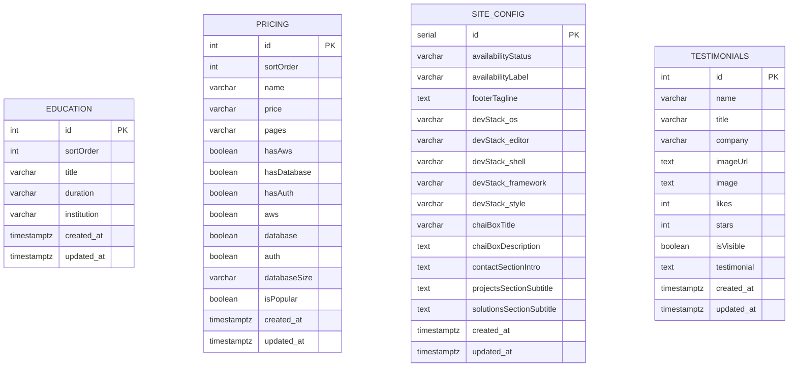
```mermaid
erDiagram
    EDUCATION {
        int id PK
        int sortOrder
        varchar title
        varchar duration
        varchar institution
        timestamptz created_at
        timestamptz updated_at
    }

    PRICING {
        int id PK
        int sortOrder
        varchar name
        varchar price
        varchar pages
        boolean hasAws
        boolean hasDatabase
        boolean hasAuth
        boolean aws
        boolean database
        boolean auth
        varchar databaseSize
        boolean isPopular
        timestamptz created_at
        timestamptz updated_at
    }

    SITE_CONFIG {
        serial id PK
        varchar availabilityStatus
        varchar availabilityLabel
        text footerTagline
        varchar devStack_os
        varchar devStack_editor
        varchar devStack_shell
        varchar devStack_framework
        varchar devStack_style
        varchar chaiBoxTitle
        text chaiBoxDescription
        text contactSectionIntro
        text projectsSectionSubtitle
        text solutionsSectionSubtitle
        timestamptz created_at
        timestamptz updated_at
    }

    TESTIMONIALS {
        int id PK
        varchar name
        varchar title
        varchar company
        text imageUrl
        text image
        int likes
        int stars
        boolean isVisible
        text testimonial
        timestamptz created_at
        timestamptz updated_at
    }
```

---

### 🏛️ Relational Domain Hierarchy

| Domain Cluster | Parent Table | Child Tables (1:N Cascading) | Key Schema Fields & Purpose |
|---|---|---|---|
| 👤 **Identity & Bio** | `profile` | `profile_typewriter_titles`<br/>`profile_interests`<br/>`about_focus` | Core developer details, bio, contacts, **`resumeUrl`**, credentials, and perspective focus models |
| 🗂️ **Projects Gallery** | `projects` | `project_tools`<br/>`project_images`<br/>`project_contributors` | Portfolio projects linked to multi-value tools, image galleries, and credited GitHub collaborators |
| 💼 **Career Timeline** | `experience` | `experience_tech` | Role history, durations, descriptions, and technology stack associations |
| 🧩 **Service Offerings** | `services` | `service_full_tech_stack`<br/>`service_implementation_steps` | Consulting offerings, implementation roadmaps, and full-stack requirements |
| 💡 **Case Solutions** | `solutions` | `solution_tech` | Problem/solution case studies with specific architectural tools |
| 🛠️ **Skill Taxonomy** | `skill_categories` / `skills` | `skill_category_items` | Categorized tech matrix, UI glow color mappings, and domain proficiencies |
| 🖥️ **Terminal CLI** | `terminal_config` | `terminal_protected_commands`<br/>`terminal_section_map` | Linux CLI configurations, root command security restrictions, and section navigation maps |
| 📦 **Standalone Records** | `education`<br/>`pricing`<br/>`site_config`<br/>`testimonials` | *Self-contained* | Academic history, pricing tiers, site-wide branding/copy, and peer testimonials |

---

### ⚡ Supabase Client & Repository Pattern

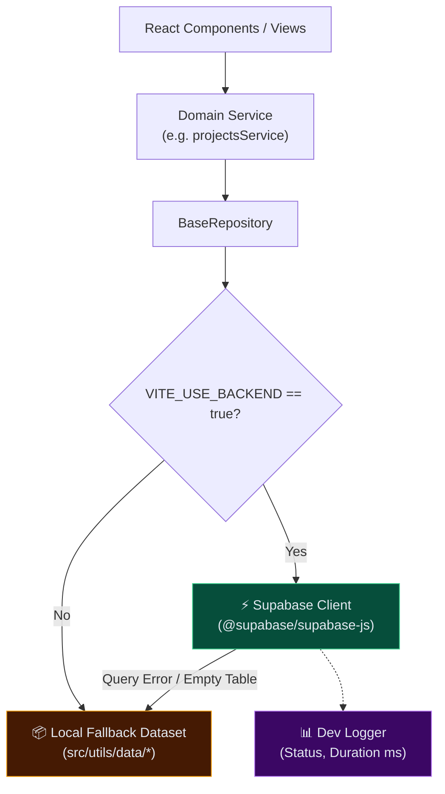
```mermaid
flowchart TD
    UI["React Components / Views"]
    SVC["Domain Service\n(e.g. projectsService)"]
    REPO["BaseRepository"]
    FLAG{"VITE_USE_BACKEND == true?"}
    SUPA["⚡ Supabase Client\n(@supabase/supabase-js)"]
    LOCAL["📦 Local Fallback Dataset\n(src/utils/data/*)"]
    LOG["📊 Dev Logger\n(Status, Duration ms)"]

    UI --> SVC --> REPO --> FLAG
    FLAG -- Yes --> SUPA
    FLAG -- No --> LOCAL
    SUPA -- "Query Error / Empty Table" --> LOCAL
    SUPA -.-> LOG

    style SUPA fill:#064e3b,stroke:#3ECF8E,color:#e2e8f0
    style LOCAL fill:#451a03,stroke:#F59E0B,color:#e2e8f0
    style LOG fill:#3b0764,stroke:#c084fc,color:#e2e8f0
```

---

## 🖥️ Interactive Terminal

A floating `CommandTerminal.jsx` provides a Linux-inspired developer interface, toggled via `Ctrl + \``.

### Capabilities

| Feature | Detail |
|---------|--------|
| 🔼 Command History | Up/Down arrow navigation through previous inputs |
| 📜 Auto-scroll | Output always scrolls to the latest log entry |
| 🔐 Session Auth | Masked password input with guest/root state management |
| ⌨️ Keyboard-first | Fully navigable via keyboard, no mouse required |
| 📱 Mobile-safe | Usable on small screens without layout breakage |

### Protected Commands

These commands require an active root session:

```
health    check    siteconfig    matrix    sudo hire    coffee
```

### Authentication Flow

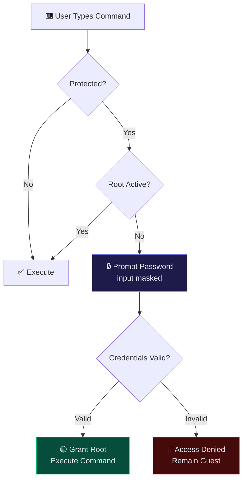
```mermaid
flowchart TD
    CMD["⌨️ User Types Command"]
    PROT{"Protected?"}
    EXEC["✅ Execute"]
    ROOT{"Root Active?"}
    PASS["🔒 Prompt Password\ninput masked"]
    VALID{"Credentials Valid?"}
    GRANT["🟢 Grant Root\nExecute Command"]
    DENY["🔴 Access Denied\nRemain Guest"]

    CMD --> PROT
    PROT -- No --> EXEC
    PROT -- Yes --> ROOT
    ROOT -- Yes --> EXEC
    ROOT -- No --> PASS --> VALID
    VALID -- Valid --> GRANT
    VALID -- Invalid --> DENY

    style GRANT fill:#064e3b,stroke:#10B981,color:#e2e8f0
    style DENY fill:#450a0a,stroke:#ef4444,color:#e2e8f0
    style PASS fill:#1e1b4b,stroke:#818cf8,color:#e2e8f0
```

### Credential Retrieval Path

Credentials are never hardcoded in the presentation layer. They are retrieved through the standard service chain:

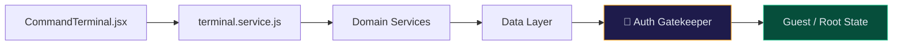
```mermaid
flowchart LR
    T["CommandTerminal.jsx"]
    TS["terminal.service.js"]
    PDS["Domain Services"]
    DL["Data Layer"]
    AG["🔑 Auth Gatekeeper"]
    SESS["Guest / Root State"]

    T --> TS --> PDS --> DL --> AG --> SESS

    style AG fill:#1e1b4b,stroke:#F59E0B,color:#e2e8f0
    style SESS fill:#064e3b,stroke:#10B981,color:#e2e8f0
```

### Session Lifecycle

| State | Description |
|-------|-------------|
| 🟡 Guest | Public commands only, no privileges |
| 🔵 Authenticating | Password prompt active, input fully masked |
| 🟢 Root | All protected commands available |

| Command | Behavior |
|---------|----------|
| `logout` | Revoke root → clear auth state → return to Guest (terminal stays open) |
| `exit` | Revoke root → clear auth state → close terminal |

> [!WARNING]
> Terminal authentication is an **interactive portfolio feature only**, not a real authorization mechanism. Privileged operations must always be enforced server-side. Never place production credentials in frontend source code.

---

## 💻 About & Sandboxed Code Playground

The About section (`src/components/about/About.jsx`) incorporates an interactive developer workspace and dual-mode mini IDE:

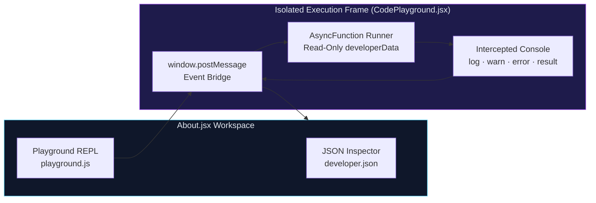
```mermaid
flowchart LR
    subgraph UI ["About.jsx Workspace"]
        TAB1["JSON Inspector\ndeveloper.json"]
        TAB2["Playground REPL\nplayground.js"]
    end

    subgraph Sandbox ["Isolated Execution Frame (CodePlayground.jsx)"]
        POST["window.postMessage\nEvent Bridge"]
        ASYNC["AsyncFunction Runner\nRead-Only developerData"]
        CONSOLE["Intercepted Console\nlog · warn · error · result"]
    end

    TAB2 --> POST --> ASYNC --> CONSOLE --> POST --> UI

    style UI fill:#0f172a,stroke:#61DAFB,color:#e2e8f0
    style Sandbox fill:#1e1b4b,stroke:#a855f7,color:#e2e8f0
```

### Key Capabilities

- **Dual-Mode Code Viewer:**
  - **`developer.json` Mode:** Syntax-highlighted JSON view with tokenized keys, strings, booleans, and numbers, single-click clipboard copy, and collapsible accordion.
  - **`playground.js` Mode:** Live JavaScript scratchpad powered by `react-simple-code-editor` and `prismjs` VS Code Dark+ theme.
- **Iframe Sandboxed Execution:** User code executes safely inside an `iframe` sandbox (`allow-scripts allow-same-origin`) using dynamic `AsyncFunction`. Host globals (`window`, `document`, `localStorage`, `parent`) are neutralized.
- **Simulated Console Output:** Output from `console.log`, `console.warn`, `console.error`, and evaluated return expressions are piped to a custom terminal output pane.
- **Engineering Perspectives Carousel:** Interactive tabbed philosophy selector (`aboutFocus`) with active indicator pagination.
- **Interactive Profile Card:** Avatar skeleton loading pulse, live availability ping badge, and copyable contact chips.

---

## 📁 Project Structure

```
apps/
└── ego-web/
    ├── src/
    │   ├── App.jsx                        ← Application root with scroll reset & layout
    │   ├── main.jsx                       ← React DOM bootstrap
    │   │
    │   ├── api/                           ← Centralized API & Service Layer
    │   │   ├── portfolio.service.js       ← Promise.allSettled domain aggregator
    │   │   │
    │   │   ├── core/                      ← Infrastructure & data clients
    │   │   │   ├── apiClient.js           ← Axios HTTP client instance
    │   │   │   ├── base.repository.js     ← Supabase generic CRUD with fallback
    │   │   │   ├── logger.js              ← Custom Morgan-style colored dev logger
    │   │   │   └── supabase.client.js     ← @supabase/supabase-js client
    │   │   │
    │   │   └── services/                  ← Domain services
    │   │       ├── contact.service.js
    │   │       ├── education.service.js
    │   │       ├── experience.service.js
    │   │       ├── offerings.service.js
    │   │       ├── pricing.service.js
    │   │       ├── profile.service.js
    │   │       ├── projects.service.js    ← Relational joins (tools, images, contributors)
    │   │       ├── site.service.js
    │   │       ├── skills.service.js
    │   │       ├── solutions.service.js
    │   │       ├── terminal.service.js
    │   │       └── testimonials.service.js
    │   │
    │   ├── components/
    │   │   ├── helper/                    ← Interactive helper subsystem
    │   │   │   ├── CodePlayground.jsx     ← In-browser sandboxed JS mini-IDE
    │   │   │   ├── CommandTerminal.jsx    ← Interactive developer terminal
    │   │   │   ├── ErrorScreen.jsx        ← Graceful error boundary screen
    │   │   │   ├── LoadingScreen.jsx      ← Glassmorphic app loading state
    │   │   │   ├── MagneticButton.jsx     ← Spring-physics magnetic hover button
    │   │   │   └── ScrollProgress.jsx     ← Fixed top scroll progress tracker
    │   │   │
    │   │   ├── about/                     ← About section & dual-mode editor
    │   │   ├── common/                    ← Shared components (MetaTags, etc.)
    │   │   ├── contact/                   ← Contact form with EmailJS integration
    │   │   ├── education/                 ← Academic timeline
    │   │   ├── experience/                ← Work history timeline
    │   │   ├── footer/                    ← Footer and social links
    │   │   ├── header/                    ← Hero section with typewriter effect
    │   │   ├── layout/                    ← AppLayout & route containers
    │   │   ├── nav/                       ← Floating navigation dock
    │   │   ├── projects/                  ← Asymmetrical bento grid & GitHub avatars
    │   │   ├── services/                  ← Service cards & investment tiers
    │   │   ├── sidebar/                   ← Social floating sidebar icons
    │   │   ├── skills/                    ← Categorized tech stack matrix
    │   │   ├── solutions/                 ← Engineering solutions showcase
    │   │   └── testimonials/              ← Client & peer testimonials
    │   │
    │   ├── hooks/
    │   │   ├── useLenis.js                ← Lenis smooth momentum scroll initialization
    │   │   └── usePortfolioData.js        ← Central portfolio fetcher with unmount guards
    │   │
    │   ├── styles/
    │   │   ├── index.css                  ← Global Tailwind styles & CSS variables
    │   │   └── prism-vsc-dark-plus.css    ← VS Code Dark+ theme for PrismJS
    │   │
    │   ├── utils/
    │   │   ├── github.js                  ← GitHub avatar CDN URL builder
    │   │   ├── images/                    ← Skill icon resolvers
    │   │   └── data/                      ← Normalized local mock & fallback datasets
    │   │       ├── contactsData.js
    │   │       ├── educations.js
    │   │       ├── experience-data.js
    │   │       ├── personal-data.js
    │   │       ├── plan-data.js
    │   │       ├── projects-data.js
    │   │       ├── services-data.js
    │   │       ├── site-config.js
    │   │       ├── skill-catagories.js
    │   │       ├── skills.js
    │   │       ├── solutionsData.js
    │   │       ├── terminalData.js
    │   │       └── testem-data.js
    │   │
    │   └── views/
    │       ├── Home.jsx                   ← Main single-page portfolio view
    │       └── ServiceDetail.jsx          ← Detailed service route
    │
    ├── docs/
    │   └── portfolio-admin.html           ← Supabase visual admin interface helper
    ├── public/
    ├── package.json
    ├── vite.config.js
    └── netlify.toml
```

---

## 🔌 External Integrations & Libraries

All external services and heavy utility libraries are cleanly isolated behind the service or helper layers:

| Integration | Abstracted Through | Purpose |
|-------------|-------------------|---------|
| ⚡ Supabase | `api/core/supabase.client.js` & `base.repository.js` | Cloud PostgreSQL database queries & live portfolio persistence |
| 🌐 Axios | `api/core/apiClient.js` | Generic HTTP client for custom endpoints |
| 📧 EmailJS | `contact.service.js` | Serverless contact form submission |
| 💻 PrismJS & Code Editor | `CodePlayground.jsx` & `About.jsx` | In-browser syntax highlighting and code editing |
| 🍞 React Hot Toast | UI layer | Floating feedback notifications |
| 🔍 React Helmet Async | `MetaTags.jsx` | Dynamic per-route SEO head metadata |
| 📜 Lenis | `useLenis.js` | Physics-based smooth momentum scrolling |
| 🐙 GitHub CDN | `utils/github.js` | Dynamic profile avatar resolution for contributors |

---

## ✨ UI / UX & Performance

### Design Stack

| Element | Technology |
|---------|-----------|
| 🎨 Styling | Tailwind CSS 3.x |
| 🎬 Animations | Framer Motion |
| 📜 Smooth Scroll | Lenis |
| ⚛️ Framework | React 18 |
| 🚀 Build | Vite |
| 🗺️ Routing | React Router DOM |

Design language: dark modern · glassmorphism surfaces · strong typography · cinematic transitions · layered visual depth.

### Performance Principles

| Approach | Detail |
|----------|--------|
| ⚡ Vite build | Tree-shaking and code splitting by default |
| 🔄 Concurrent data | `Promise.allSettled` across all domain services |
| 🧠 Memoization | Only applied where render cost clearly justifies it |
| 🛣️ Lazy routes | Applied where appropriate for initial load speed |
| 🖼️ Optimized images | Compressed, correct formats |
| 🎞️ Safe animations | Never compromise usability or cause layout thrash |

---

## 🛡️ Security

| Practice | Applied Where |
|----------|--------------|
| 🔒 No hardcoded credentials | Terminal uses service-driven credential retrieval |
| 🚫 No real secrets in source | Sensitive values live in `.env` only |
| ✅ Input validation | Contact form validated before any submission |
| 🧹 No unsafe HTML injection | Dynamic content sanitized at render |
| 🗃️ No sensitive browser storage | Auth state lives in React state only (never localStorage) |
| ⚠️ Client auth = feature only | Clearly scoped; real authorization must be server-side |

---

## ♿ Accessibility & 📱 Responsive Design

**Responsive:** Full support from 320px mobile to wide desktop. The terminal remains usable on small screens with no horizontal overflow, broken layouts, or overlapping UI elements.

**Accessible:** Semantic HTML, full keyboard navigation, visible focus states, ARIA attributes, sufficient contrast, and reduced-motion consideration throughout. The terminal is fully keyboard-accessible.

---

## 📬 Contact System

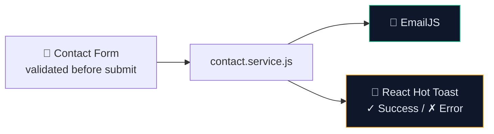
```mermaid
flowchart LR
    FORM["📝 Contact Form\nvalidated before submit"]
    SVC["contact.service.js"]
    EJS["📧 EmailJS"]
    TOAST["🍞 React Hot Toast\n✓ Success / ✗ Error"]

    FORM --> SVC --> EJS
    SVC --> TOAST

    style EJS fill:#0f172a,stroke:#10B981,color:#e2e8f0
    style TOAST fill:#0f172a,stroke:#F59E0B,color:#e2e8f0
```

EmailJS logic is fully contained in `contact.service.js`. The React component only calls the service and handles the toast response.

---

## 🔌 Backend Design Guide

This section documents the full architecture for migrating Ego Web from static local data to a live NestJS + PostgreSQL backend — the system's designed future state.

---

### 🧱 Stack

| Layer | Technology | Reason |
|-------|-----------|--------|
| API Framework | NestJS | Module-based; mirrors the frontend's domain structure exactly |
| ORM | TypeORM | Entity-first design, built-in migration support |
| Database | PostgreSQL | Relational, stable, production-proven |
| Auth | JWT + bcrypt | Short-lived tokens, properly hashed credentials |
| Validation | class-validator | DTO-level request validation |
| API Docs | Swagger | Auto-generated from NestJS decorators |
| Email | Nodemailer | Move contact delivery fully server-side |

---

### 📐 Module Structure

NestJS modules mirror the frontend's 11 content domains directly. Each module owns its own controller, service, entity, DTO, and repository.

```
src/
├── profile/
├── projects/
├── experience/
├── education/
├── services/
├── skills/
├── testimonials/
├── solutions/
├── pricing/
├── site-config/
└── terminal/
    └── auth/              ← JWT-based terminal session management
```

---

### 🗄️ Relational Schema & Migration Strategy

The backend schema mirrors the 11 content domains and 25 relational tables. See [Enhanced Entity-Relationship Diagram (EERD)](#-enhanced-entity-relationship-diagram-eerd) above for the complete visual entity model and attribute types.

Initial migration and table creation should be executed using the normalized schema definitions:

- **Entity Relationships:** Implement strict TypeORM/Prisma relations with `ON DELETE CASCADE` on all child tables (`project_tools`, `profile_interests`, `experience_tech`, etc.).
- **Automatic Timestamps:** Ensure `created_at` and `updated_at` timestamps are managed via database triggers (`set_updated_at()`).
- **Initial Seeding:** Seed initial database records directly from the normalized frontend data modules under `src/utils/data/`.

---

### 🌐 API Endpoint Design

All endpoints are prefixed with `/api` and follow standard REST conventions.

| Method | Endpoint | Auth | Description |
|--------|----------|:----:|-------------|
| `GET` | `/api/profile` | ❌ | Personal info and bio |
| `GET` | `/api/projects` | ❌ | All projects |
| `GET` | `/api/projects/:id` | ❌ | Single project detail |
| `GET` | `/api/experience` | ❌ | Experience timeline |
| `GET` | `/api/education` | ❌ | Education history |
| `GET` | `/api/services` | ❌ | Service catalog |
| `GET` | `/api/services/:id` | ❌ | Service detail |
| `GET` | `/api/skills` | ❌ | Skills matrix |
| `GET` | `/api/testimonials` | ❌ | Testimonials |
| `GET` | `/api/solutions` | ❌ | Solution packages |
| `GET` | `/api/pricing` | ❌ | Pricing tiers |
| `GET` | `/api/site-config` | ❌ | Site configuration |
| `POST` | `/api/contact` | ❌ | Submit contact form |
| `POST` | `/api/terminal/auth` | ❌ | Authenticate terminal session |
| `DELETE` | `/api/terminal/auth` | 🔐 JWT | Revoke terminal session (logout) |

---

### 🔐 Terminal Authentication — Backend Flow

Move terminal credentials entirely out of the frontend. The password is stored as a bcrypt hash server-side.

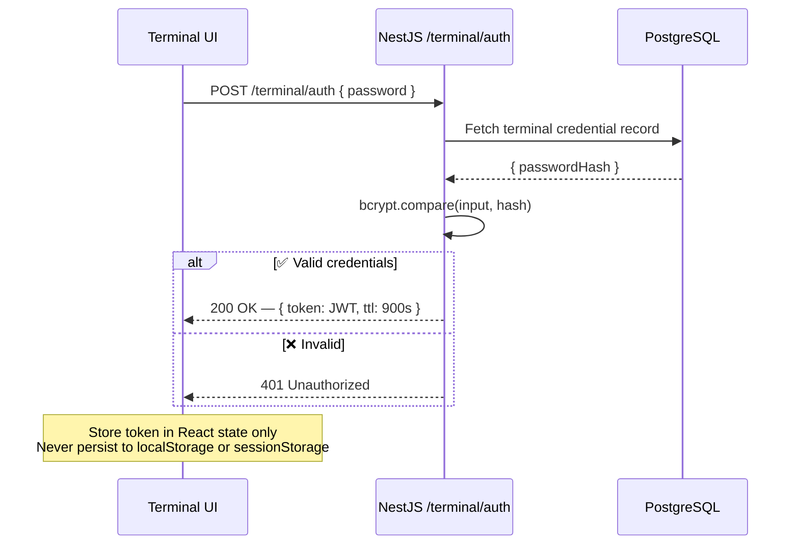
```mermaid
sequenceDiagram
    participant T as Terminal UI
    participant A as NestJS /terminal/auth
    participant DB as PostgreSQL

    T->>A: POST /terminal/auth { password }
    A->>DB: Fetch terminal credential record
    DB-->>A: { passwordHash }
    A->>A: bcrypt.compare(input, hash)

    alt ✅ Valid credentials
        A-->>T: 200 OK — { token: JWT, ttl: 900s }
    else ❌ Invalid
        A-->>T: 401 Unauthorized
    end

    Note over T: Store token in React state only<br/>Never persist to localStorage or sessionStorage
```

JWT tokens must have a short TTL (15 minutes recommended) and must not be persisted to any browser storage.

---

### ⚙️ Environment Variables

```env
# ─── Frontend (.env) ─────────────────────────────────────
# Supabase Cloud Database Integration
VITE_SUPABASE_URL=https://your-project.supabase.co
VITE_SUPABASE_PUBLISHABLE_KEY=your-supabase-publishable-anon-key

# Data Mode Switch (true: Live Supabase DB queries | false: Offline local data)
VITE_USE_BACKEND=true

# Optional Legacy / REST API Fallback Base URL
VITE_API_URL=http://localhost:5000/api
```

---

### 🔗 Data Layer & Supabase Integration Point

The frontend uses `BaseRepository` (`src/api/core/base.repository.js`) to handle data querying and automatic local fallback:

```javascript
// BaseRepository — Live Supabase Query with Graceful Fallback
async getAll(params = {}) {
  // 1. If VITE_USE_BACKEND is false, instantly serve local domain mock
  if (!this.useBackend && this.localMockData !== null) {
    return Promise.resolve(this.localMockData);
  }

  try {
    // 2. Query Supabase table matching endpoint name
    let query = this.supabase.from(this.endpoint).select('*');
    const { data, error } = await query;
    if (error) throw error;
    
    // 3. Fall back to local mock data if table is empty or unpopulated
    if ((!data || data.length === 0) && this.localMockData !== null) {
      return this.localMockData;
    }
    return data;
  } catch (error) {
    // 4. Catch network/database failures and gracefully recover with mock data
    logger.error(this.endpoint, 'Failed query, using fallback', error);
    return Promise.resolve(this.localMockData);
  }
}
```

This guarantees that:
1. When connected to Supabase (`VITE_USE_BACKEND=true`), changes in Supabase appear immediately.
2. If offline or if database credentials are not configured, the site continues to operate with zero breaking errors.

---

### 🚀 Backend Deployment

| Service | Purpose |
|---------|---------|
| Railway / Render | NestJS API hosting |
| Supabase / Neon | Managed PostgreSQL |
| Netlify | Frontend (completely unchanged) |
| GitHub Actions | CI/CD — test, build, deploy pipeline |

Configure CORS to allow requests only from your Netlify domain:

```typescript
// main.ts
app.enableCors({
  origin: ['https://yourdomain.netlify.app'],
  methods: ['GET', 'POST', 'DELETE'],
  allowedHeaders: ['Content-Type', 'Authorization'],
});
```

---

### ✅ Backend Migration Checklist

- [ ] Initialize NestJS project with TypeORM and PostgreSQL connection
- [ ] Create entities for all 11 domains
- [ ] Write initial migration and seed from existing static data files
- [ ] Implement `terminal/auth` module with JWT guard and bcrypt comparison
- [ ] Move contact delivery to backend with Nodemailer
- [ ] Set `VITE_API_BASE_URL` in frontend `.env`
- [ ] Update `BaseRepository` to route through `apiClient`
- [ ] Add `@UseGuards(JwtAuthGuard)` to terminal logout endpoint
- [ ] Configure CORS for the Netlify production domain
- [ ] Enable Swagger at `/api/docs` for auto-generated API documentation
- [ ] Deploy backend and smoke-test every frontend route against the live API
- [ ] Remove all credential-related data from frontend static files

---

## 🚀 Local Development

### Requirements

| Requirement | Version |
|-------------|---------|
| Node.js | 18+ |
| npm / pnpm | Latest stable |

### Commands

```bash
# Install dependencies
npm install

# Start dev server with HMR
npm run dev

# Production build (must pass cleanly before any deployment)
npm run build
```

The application must produce a clean `npm run build` with zero console errors before any production deployment.

---

## 🌐 Deployment

Deployed on **Netlify**. The `netlify.toml` configuration handles SPA routing (all paths redirect to `index.html`), production build settings, and security headers. Maintain this file whenever routing or build behavior changes.

---

## 📋 Production Rules

Every change to the codebase must follow these rules:

| # | Rule |
|---|------|
| 1 | 🏗️ Preserve **Presentation → Service → Data**. Never bypass a layer. |
| 2 | 🧩 Keep domain logic outside presentation components. |
| 3 | 📦 Keep all portfolio data normalized in its domain files. |
| 4 | ⚙️ Centralize site configuration in `site-config.js`. |
| 5 | 🖥️ All terminal logic stays in the helper layer, accessed via `terminal.service.js`. |
| 6 | 🔐 Protected commands must pass through the authentication gatekeeper. |
| 7 | 🚪 Explicitly clear root privileges on every `logout` and `exit`. |
| 8 | 🚫 Never expose real credentials in frontend source code. |
| 9 | ⚠️ Treat frontend auth as an interactive feature, not real authorization. |
| 10 | 🔌 Keep all external integrations behind service abstractions. |
| 11 | 🔜 Every architectural decision must preserve backend migration compatibility. |
| 12 | 📱 Preserve responsive behavior and accessibility on every change. |
| 13 | 💀 Maintain loading and error states throughout — no blank screens. |
| 14 | ✅ Verify `npm run build` passes cleanly after significant changes. |
| 15 | 📝 Update `docs/SYSTEM_FLOW.md` when architecture changes. |

---

## 📬 Contact & Links

| Channel | Link |
|---------|------|
| 📧 Email | [rajahaider7896@gmail.com](mailto:rajahaider7896@gmail.com) |
| 💬 WhatsApp | +92 322 5629058 |
| 🐙 GitHub | [Haiderali445](https://github.com/Haiderali445) |
| 💼 LinkedIn | [haider-ali-8a025b290](https://www.linkedin.com/in/haider-ali-8a025b290/) |
| 📸 Instagram | [hayder_alyy__](https://www.instagram.com/hayder_alyy__/) |
| 🌐 Live Site | [haideraliblog.netlify.app](https://haideraliblog.netlify.app/) |

---

## 📜 License

**Personal Use Only.**

You may download, clone, fork, customize, and self-host. Pull requests and public collaboration are not accepted.

---

<div align="center">

**Ego Web** is not a portfolio template. It is an engineering system that demonstrates **how the engineer thinks about software** — and where it's going next.

</div>