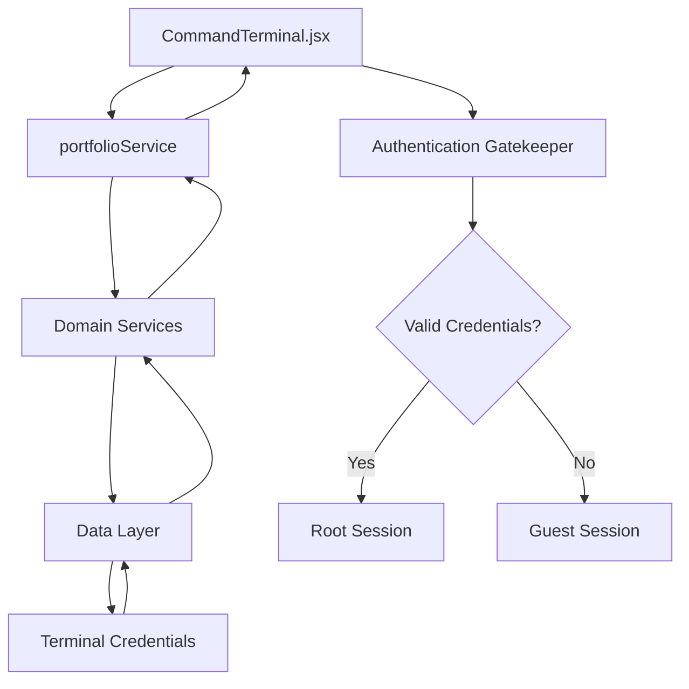
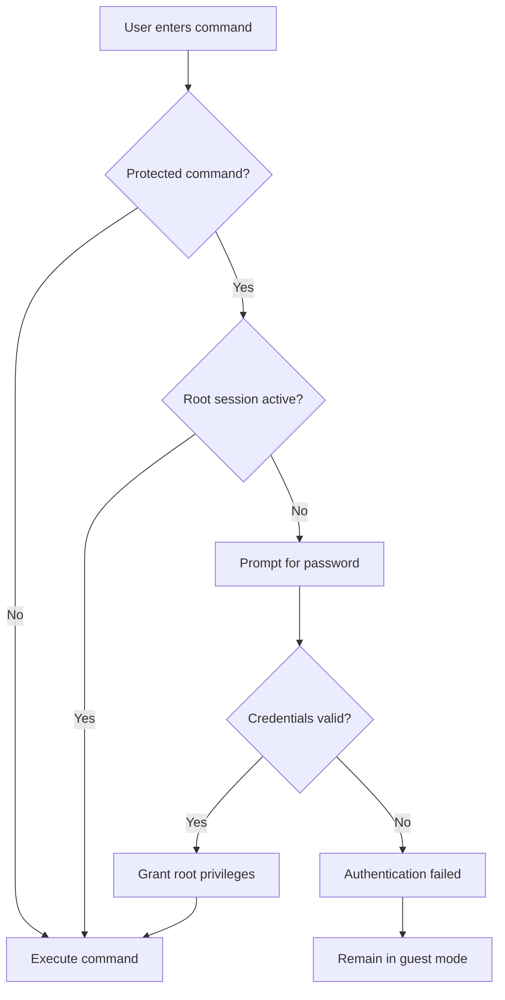
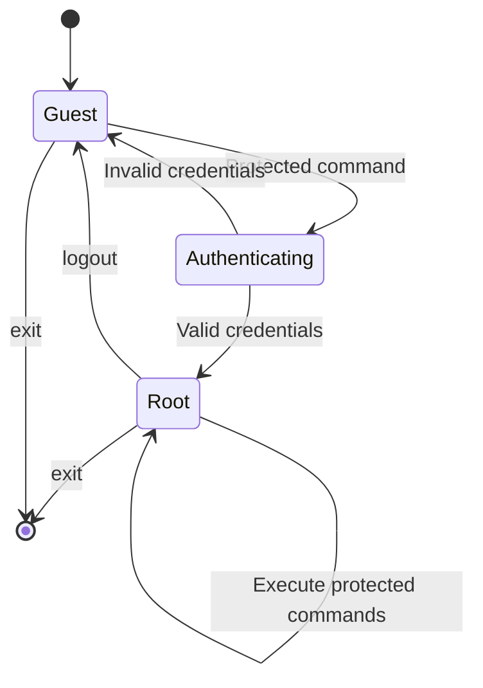
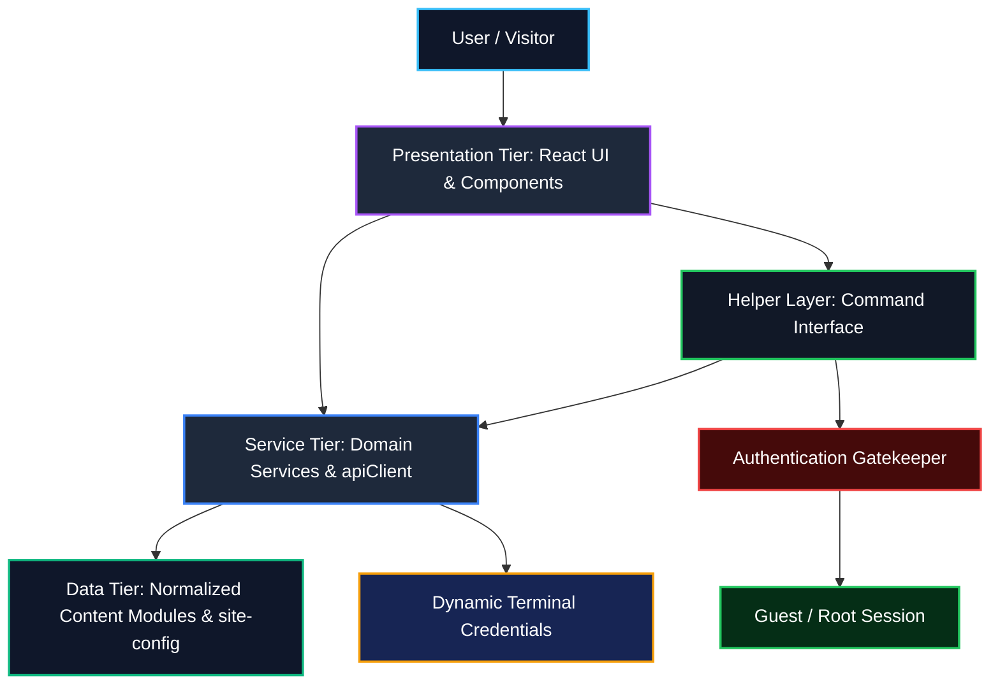
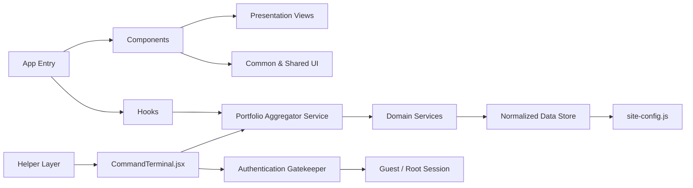
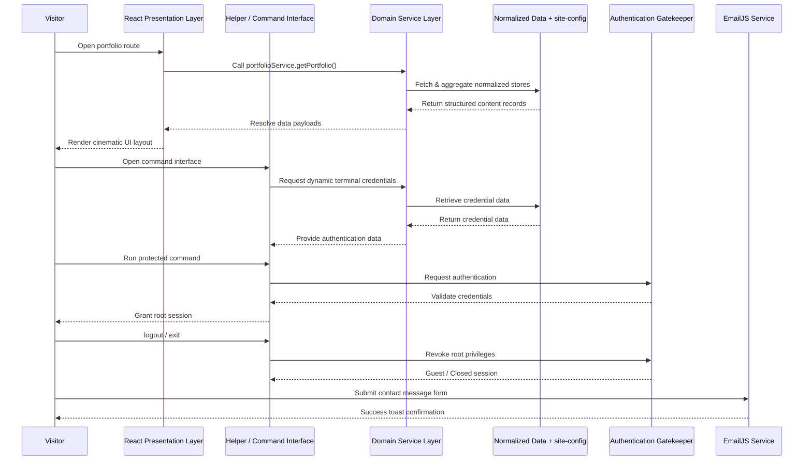
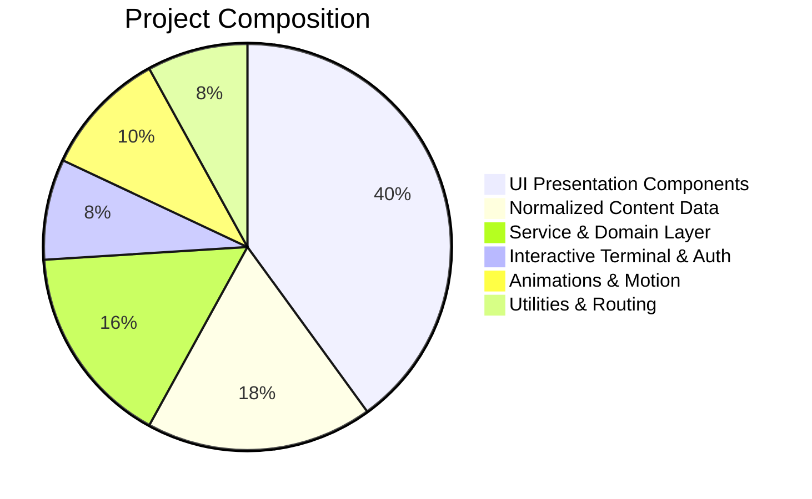
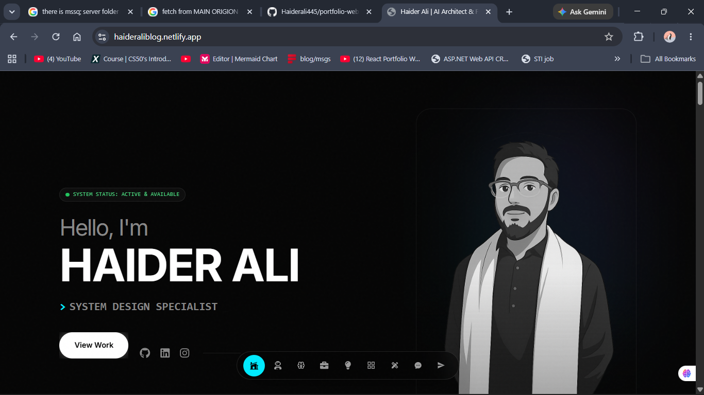

# ⚡ Ego Web — High-Performance Portfolio Architecture

> A cinematic, high-fidelity portfolio experience for a modern software engineer, built as a polished frontend layer featuring strict 3-tier separation of concerns, dynamic service-driven data access, and an interactive secure command interface.

---

<div align="center">

  
  
  
  
  
  
  

</div>

## 🛑 Usage & Collaboration Notice

> [!IMPORTANT]
> This repository is **strictly closed for public contributions and active collaboration**. However, you are welcome to **download, fork, or clone** this codebase for your own personal use, inspiration, portfolio customization, or self-hosted adaptation.

---

## Overview

This project is more than a personal website. It is a carefully crafted digital identity system that showcases engineering capability, product thinking, design sensibility, and communication clarity.

The frontend is built with React and Vite and follows a strict separation between presentation, domain services, and normalized data. The system combines a premium cinematic interface with an architecture designed for maintainability, scalability, and future backend integration.

The portfolio also includes an **interactive developer command interface**, allowing visitors to interact with the portfolio through a Linux-inspired terminal experience while keeping restricted system commands behind an authentication gate.

The experience combines:

* A high-impact landing experience
* Section-based storytelling for skills, services, projects, education, and experience
* Animated interactions and motion design
* A normalized 3-tier content architecture
* Dedicated site configuration through `site-config.js`
* Dynamic service-driven terminal credentials
* A secure interactive command interface
* Protected root-level commands
* Guest and authenticated session management
* An API-ready foundation for future backend integration

---

## What This System Does

The portfolio is organized around several core experiences:

1. Hero + personal introduction
2. About and capabilities section
3. Skills and technology stack showcase
4. Experience & education timelines
5. Service deep-dive pages
6. Project gallery with code and live-demo links
7. Interactive command interface
8. Protected system commands and authentication
9. Contact and social engagement

It is designed to make a strong first impression while also acting as a professional portfolio for hiring managers, collaborators, and clients.

---

# 🖥️ Secure Command Interface

One of the latest additions to the portfolio is a floating developer-style command interface implemented through `CommandTerminal.jsx`.

The command interface is organized within the project's **helper layer** rather than being treated as a separate architectural tier.

It is designed to feel like a real developer Linux terminal while remaining integrated with the portfolio's existing service and data architecture.

### Terminal Capabilities

* Floating command interface
* Keyboard shortcut support
* `Ctrl + `` terminal toggle
* Command history navigation
* Up/Down arrow key history
* Automatically scrolling command logs
* Guest and authenticated/root sessions
* Masked password input
* Protected system commands
* Dynamic credential retrieval
* Service-layer integration
* Logout and exit handling

The terminal acts as an interactive system interface rather than simply being a visual terminal mockup.

---

## 🔐 Dynamic Service-Tier Authentication & Credentials

Terminal authentication was redesigned to remove hardcoded credentials from environment variables and static frontend constants.

Instead of storing terminal credentials directly inside the UI layer, the command interface retrieves the required authentication data dynamically through the application's service and data architecture.

### Authentication Flow


```mermaid
flowchart TD
    A[CommandTerminal.jsx] --> B[portfolioService]
    B --> C[Domain Services]
    C --> D[Data Layer]
    D --> E[Terminal Credentials]
    E --> D
    D --> C
    C --> B
    B --> A
    A --> F[Authentication Gatekeeper]
    F --> G{Valid Credentials?}
    G -->|Yes| H[Root Session]
    G -->|No| I[Guest Session]
```

The terminal therefore follows the same architectural principles as the rest of the portfolio:

```text
Presentation / Helper
        ↓
Service Layer
        ↓
Data Layer
```

This keeps credential retrieval and authentication-related data access separated from the terminal's presentation and interaction logic.

> [!NOTE]
> The frontend terminal authentication is intended for the portfolio's interactive experience. Production-sensitive authentication, authorization, and privileged backend operations should ultimately be enforced server-side.

---

# 🛡️ Protected Root Commands & Gatekeeper

Restricted terminal commands are protected behind an authentication gatekeeper.

Commands that require elevated privileges include:

```text
health
check
siteconfig
matrix
sudo hire
coffee
```

When a restricted command is executed without an authenticated session, the command interface prompts the user for a password.

### Authentication Behavior


```mermaid
flowchart TD
    A[User enters command] --> B{Protected command?}
    B -->|No| C[Execute command]
    B -->|Yes| D{Root session active?}
    D -->|Yes| C
    D -->|No| E[Prompt for password]
    E --> F{Credentials valid?}
    F -->|Yes| G[Grant root privileges]
    G --> C
    F -->|No| H[Authentication failed]
    H --> I[Remain in guest mode]
```

Password input is masked during authentication to prevent the credential from being visually exposed in the command interface.

---

# 🔑 Smart Session & Exit Handling

The command interface includes session-aware privilege management.

Once authenticated, the user can execute protected commands during the active root session.

The session can be explicitly terminated using:

```bash
logout
```

or:

```bash
exit
```

### Logout Behavior

When `logout` is executed:

1. Root privileges are revoked.
2. The authenticated session is cleared.
3. The user returns to guest mode.
4. The command interface remains available.

### Exit Behavior

When `exit` is executed:

1. Root privileges are revoked.
2. The authenticated session is cleared.
3. The command interface closes.

This prevents an authenticated/root state from remaining active after the user intentionally leaves the session.

---

## Terminal Security Model


```mermaid
stateDiagram-v2
    [*] --> Guest

    Guest --> Authenticating: Protected command
    Authenticating --> Root: Valid credentials
    Authenticating --> Guest: Invalid credentials

    Root --> Root: Execute protected commands
    Root --> Guest: logout
    Root --> [*]: exit

    Guest --> [*]: exit
```

The terminal maintains a clear distinction between:

* **Guest mode** — Standard public commands
* **Authenticating** — Credential verification state
* **Root mode** — Elevated terminal privileges

---

# 🏗️ Architecture at a Glance & 3-Tier Separation

`ego-web` utilizes a strict **3-Tier Frontend Architecture**:

**Presentation ➔ Service ➔ Data Layer**

This ensures UI components do not directly query raw data stores or third-party integrations.


```mermaid
flowchart TD
    A[User / Visitor] --> B[Presentation Tier: React UI & Components]
    B --> C[Service Tier: Domain Services & apiClient]
    C --> D[Data Tier: Normalized Content Modules & site-config]

    B --> E[Helper Layer: Command Interface]
    E --> C

    C --> F[Dynamic Terminal Credentials]
    E --> G[Authentication Gatekeeper]
    G --> H[Guest / Root Session]

    style A fill:#0f172a,stroke:#38bdf8,stroke-width:2px,color:#fff
    style B fill:#1e293b,stroke:#a855f7,stroke-width:2px,color:#fff
    style C fill:#1e293b,stroke:#3b82f6,stroke-width:2px,color:#fff
    style D fill:#0f172a,stroke:#10b981,stroke-width:2px,color:#fff
    style E fill:#111827,stroke:#22c55e,stroke-width:2px,color:#fff
    style F fill:#172554,stroke:#f59e0b,stroke-width:2px,color:#fff
    style G fill:#450a0a,stroke:#ef4444,stroke-width:2px,color:#fff
    style H fill:#052e16,stroke:#22c55e,stroke-width:2px,color:#fff
```

The helper layer supports interactive functionality but does **not** replace the three primary architectural tiers.

---

## Frontend Flow

The application loads through a centralized hook:

```text
usePortfolioData
       ↓
portfolioService
       ↓
Domain Services
       ↓
Normalized Data
```

The home screen composes major sections from the unified normalized dataset.

Service pages are routed dynamically for deeper content exploration.

The command interface follows the same service-driven model:

```text
CommandTerminal.jsx
       ↓
portfolioService
       ↓
Domain Services
       ↓
Data Layer
       ↓
Dynamic Credentials
       ↓
Authentication Gatekeeper
       ↓
Guest / Root Session
```

Motion and UI polish are layered on top of this content and service structure to create the premium portfolio experience.

---

# ✨ Core Features

## Premium UI Experience

* Dark, modern visual language
* Glassmorphism-inspired cards and surfaces
* Smooth inertial scrolling with Lenis
* Animated transitions with Framer Motion
* Responsive desktop, tablet, and mobile layouts
* Floating interactive command interface

## Content & Data Architecture

* Static content separated into normalized data modules
* Strict primary keys and sorting indices
* Dedicated `site-config.js` configuration file
* Site copy and layout configuration decoupled from UI components
* Service pages routed and rendered with dedicated detail views
* Dynamic terminal credential retrieval through the service layer

## Interactive Portfolio Experience

* Animated hero and section transitions
* Project cards with hover states and CTAs
* Contact form isolated behind a service abstraction layer
* Social links and direct communication channels
* Developer-style interactive command interface
* Command history and keyboard navigation
* Guest/root session states
* Protected terminal commands

## Security-Oriented Terminal Features

* No hardcoded terminal credentials in the UI
* Dynamic credential retrieval
* Protected root commands
* Password masking
* Authentication gatekeeper
* Root privilege management
* Explicit logout handling
* Session cleanup on exit

## Future-Ready Design

The service layer is structured to seamlessly switch from local static data modules to a remote NestJS / PostgreSQL backend without requiring major UI changes.

The architecture also provides a clear migration path for moving terminal authentication and privileged command execution to a backend-controlled authorization system.

---

# 🧰 Tech Stack

## Frontend Core & Styling

* **React 18** — Component-driven declarative UI orchestration
* **Vite** — High-performance module bundling and HMR execution
* **React Router DOM** — Sub-route orchestration and dynamic view transitions
* **Tailwind CSS** — Utility-first styling with custom glassmorphism tokens

## Motion & Interaction

* **Framer Motion** — Cinematic layout animations and scroll orchestration
* **Lenis** — Smooth global inertial scrolling engine
* **CommandTerminal.jsx** — Interactive developer command interface

## Utilities & Integrations

* **Axios** — Configured network client layer (`apiClient.js`)
* **React Hot Toast** — Non-blocking notification feedback loops
* **React Helmet Async** — Dynamic runtime SEO head tag management
* **EmailJS** — Communication delivery abstracted through the service tier

---

# 📁 Project Structure

```text
apps/
└── ego-web/
    ├── src/
    │   ├── App.jsx
    │   │   # App root, router orchestrator, & Lenis provider
    │   │
    │   ├── main.jsx
    │   │   # Application mounting entry point
    │   │
    │   ├── components/
    │   │   # 🎨 Presentation Layer
    │   │   ├── about/
    │   │   ├── common/
    │   │   ├── contact/
    │   │   ├── experience/
    │   │   ├── footer/
    │   │   ├── home/
    │   │   ├── nav/
    │   │   ├── projects/
    │   │   ├── services/
    │   │   └── skills/
    │   │
    │   ├── hooks/
    │   │   # 🎣 State & Lifecycle Layer
    │   │   └── usePortfolioData.js
    │   │
    │   ├── helper/
    │   │   # 🧰 Shared helper & interactive functionality
    │   │   └── CommandTerminal.jsx
    │   │
    │   ├── services/
    │   │   # ⚙️ Service Layer
    │   │   ├── apiClient.js
    │   │   ├── contact.service.js
    │   │   ├── education.service.js
    │   │   ├── experience.service.js
    │   │   ├── offerings.service.js
    │   │   ├── portfolio.service.js
    │   │   ├── pricing.service.js
    │   │   ├── profile.service.js
    │   │   ├── projects.service.js
    │   │   ├── site.service.js
    │   │   ├── skills.service.js
    │   │   ├── solutions.service.js
    │   │   └── testimonials.service.js
    │   │
    │   ├── styles/
    │   │   └── index.css
    │   │
    │   └── utils/
    │       # 🗄️ Data Layer
    │       └── data/
    │           ├── personal-data.js
    │           ├── site-config.js
    │           ├── projects/
    │           ├── experience/
    │           ├── education/
    │           ├── services/
    │           ├── skills/
    │           ├── testimonials/
    │           └── pricing/
    │
    ├── docs/
    │   └── SYSTEM_FLOW.md
    │
    ├── package.json
    ├── vite.config.js
    └── netlify.toml
```

---

## Visual Folder Map


```mermaid
flowchart LR
    A[App Entry] --> B[Components]
    B --> C[Presentation Views]
    B --> D[Common & Shared UI]

    A --> E[Hooks]
    E --> F[Portfolio Aggregator Service]

    H[Helper Layer] --> T[CommandTerminal.jsx]
    T --> F
    T --> I[Authentication Gatekeeper]
    I --> J[Guest / Root Session]

    F --> G[Domain Services]
    G --> K[Normalized Data Store]
    K --> L[site-config.js]
```

---

# 🧩 Key Areas

### `src/components`

UI sections and feature modules:

* About
* Contact
* Experience
* Footer
* Home
* Navigation
* Projects
* Services
* Skills
* Shared/common UI

### `src/hooks`

State management, lifecycle handling, and centralized portfolio data consumption.

* `usePortfolioData.js`

### `src/helper`

Shared helper and interactive functionality.

* `CommandTerminal.jsx` — Interactive command interface, command handling, history, authentication state, and session behavior.

### `src/services`

Domain service layer responsible for abstracting data sources, aggregation, authentication-related data access, and external integrations.

### `src/utils/data`

Normalized portfolio content modules and centralized site configuration.

### `docs`

Product architecture, system flow, and future backend integration documentation.

---

# 📊 Data Model & Services Overview

The portfolio is powered by a normalized content architecture consisting of:

### Profile Data

**`personal-data.js`**

Contains:

* Core identity
* Biography
* Contact information
* Social links
* Typewriter titles
* Engineering interests

### Site Configuration

**`site-config.js`**

Provides centralized website configuration such as:

* Status badges
* Section subtitles
* Technology manifests
* Branding copy
* Site-wide configuration
* System-related configuration

Keeping site configuration in its own dedicated data file prevents configuration and branding information from being scattered throughout UI components.

### Domain Modules

The normalized domain data includes:

* Projects
* Experiences
* Education
* Service offerings
* Skills
* Testimonials
* Solutions
* Pricing tiers
* Terminal-related authentication data

The `portfolioService` acts as the central aggregation point for portfolio data and can concurrently resolve multiple domain services.

---

# 🔄 System Flow


```mermaid
sequenceDiagram
    participant Visitor
    participant Frontend as React Presentation Layer
    participant Helper as Helper / Command Interface
    participant Service as Domain Service Layer
    participant Data as Normalized Data + site-config
    participant Auth as Authentication Gatekeeper
    participant Contact as EmailJS Service

    Visitor->>Frontend: Open portfolio route
    Frontend->>Service: Call portfolioService.getPortfolio()
    Service->>Data: Fetch & aggregate normalized stores
    Data-->>Service: Return structured content records
    Service-->>Frontend: Resolve data payloads
    Frontend-->>Visitor: Render cinematic UI layout

    Visitor->>Helper: Open command interface
    Helper->>Service: Request dynamic terminal credentials
    Service->>Data: Retrieve credential data
    Data-->>Service: Return credential data
    Service-->>Helper: Provide authentication data

    Visitor->>Helper: Run protected command
    Helper->>Auth: Request authentication
    Auth-->>Helper: Validate credentials
    Helper-->>Visitor: Grant root session

    Visitor->>Helper: logout / exit
    Helper->>Auth: Revoke root privileges
    Auth-->>Helper: Guest / Closed session

    Visitor->>Contact: Submit contact message form
    Contact-->>Visitor: Success toast confirmation
```

---

# ⌨️ Terminal Command Model

The command interface operates with two primary privilege levels:

```text
┌─────────────────────────────┐
│           GUEST             │
│                             │
│ Public commands available   │
│ No root privileges          │
└──────────────┬──────────────┘
               │
               │ Protected command
               ▼
┌─────────────────────────────┐
│       AUTHENTICATION        │
│                             │
│ Password input is masked    │
└──────────────┬──────────────┘
               │
          Valid credentials
               ▼
┌─────────────────────────────┐
│            ROOT             │
│                             │
│ Protected commands enabled  │
│ Session privileges active   │
└──────────────┬──────────────┘
               │
          logout / exit
               ▼
        Privileges revoked
```

---

# 🚀 Getting Started Locally

## Prerequisites

* Node.js 18+
* npm or pnpm

## Clone the Repository

```bash
git clone https://github.com/Haiderali445/portfolio-website.git
cd portfolio-website
```

## Install Dependencies

```bash
npm install
```

## Run Locally

```bash
npm run dev
```

Then open the local Vite URL shown in the terminal.

## Build for Production

```bash
npm run build
```

---

# 📈 Quick Project Health Chart


```mermaid
pie title Project Composition
    "UI Presentation Components" : 40
    "Normalized Content Data" : 18
    "Service & Domain Layer" : 16
    "Interactive Terminal & Auth" : 8
    "Animations & Motion" : 10
    "Utilities & Routing" : 8
```

---

# 🧱 Build & Footer Experience

The portfolio includes a polished footer section built from contact data and social channels.

The footer presents:

* Professional email address
* WhatsApp / phone contact
* GitHub, LinkedIn, and Instagram profiles
* Clear call-to-action for collaboration

---

# 📬 Contact & Social Links

* **Email:** [rajahaider7896@gmail.com](mailto:rajahaider7896@gmail.com)
* **WhatsApp:** +92 322 5629058
* **GitHub:** https://github.com/Haiderali445
* **LinkedIn:** https://www.linkedin.com/in/haider-ali-8a025b290/
* **Instagram:** https://www.instagram.com/hayder_alyy__/

---

# ☁️ Deployment

This app is optimized for static hosting platforms such as Netlify.

The repository includes:

* `netlify.toml` for Netlify routing and build configuration
* Standard Vite production build workflow
* `npm run build` production compilation

---

# 📚 Documentation

For a broader view of the overall system architecture and future backend migration roadmap, see:

* `docs/SYSTEM_FLOW.md`

---

# ⭐ Why This Project Stands Out

This portfolio is built with precision:

* Premium, immersive user experience
* Strict separation between presentation, services, and data
* Normalized and modular content architecture
* Dedicated `site-config.js` configuration layer
* Dynamic service-driven terminal authentication
* Protected root-level terminal commands
* Session-aware privilege management
* Interactive Linux-inspired command interface
* Keyboard-driven command history
* Scalable service architecture
* Backend-ready data flow
* Strong foundation for future CMS and API integration

The result is not simply a portfolio website.

It is an **interactive engineering showcase** designed to demonstrate both frontend craftsmanship and architectural thinking.

---

# 🔗 Links

* **Live Site:** https://haideraliblog.netlify.app/
* **GitHub:** https://github.com/Haiderali445
* **LinkedIn:** https://www.linkedin.com/in/haider-ali-8a025b290/
* **Instagram:** https://www.instagram.com/hayder_alyy__/
* **Email:** [rajahaider7896@gmail.com](mailto:rajahaider7896@gmail.com)

---

# 📜 License & Permissions

Distributed for **Personal Use Only**.

You are free to download, fork, and customize this repository for your own personal portfolio needs.

Public collaboration and pull requests are not accepted.

---

# 🖼️ Preview & Demo



**[Live Demo](https://haideraliblog.netlify.app/)** • **[System Flow Docs](docs/SYSTEM_FLOW.md)** • **[GitHub](https://github.com/Haiderali445)**
