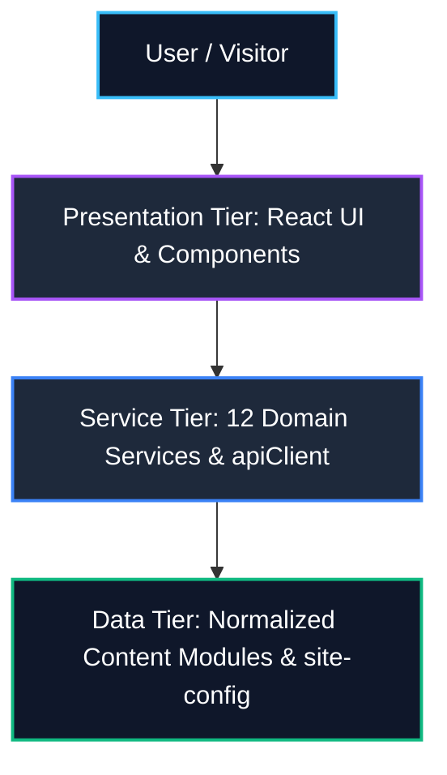
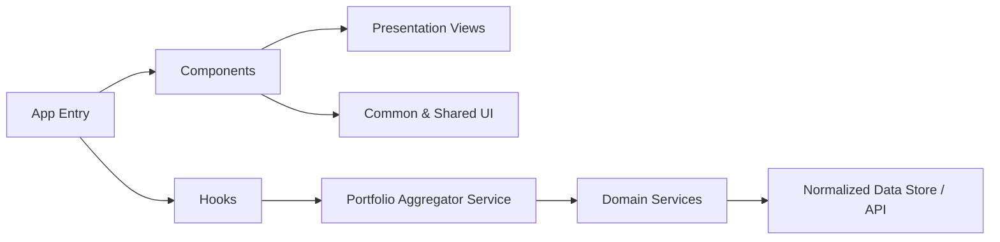
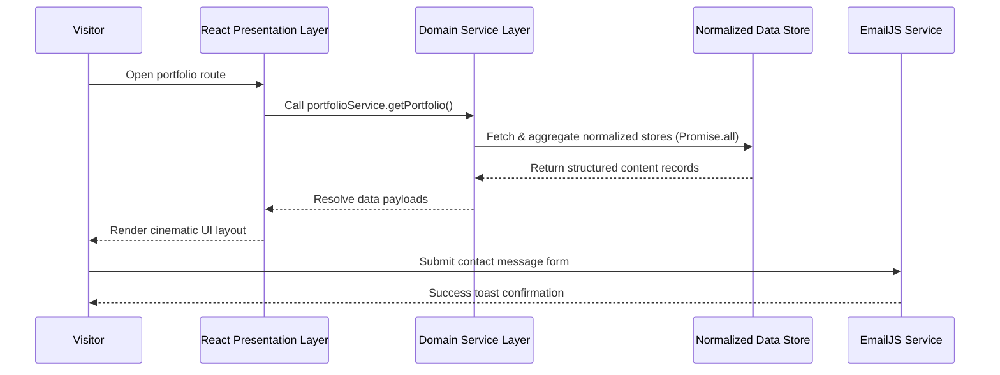
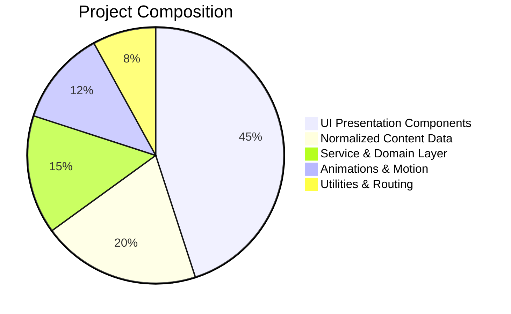

# ⚡ Ego Web — High-Performance Portfolio Architecture

> A cinematic, high-fidelity portfolio experience for a modern software engineer, built as a polished frontend layer featuring strict 3-tier separation of concerns and an architecture ready for dynamic backend integration.

---
<div align="center">

  
  
  
  
  

</div>

## 🛑 Usage & Collaboration Notice

> [!IMPORTANT]
> This repository is **strictly closed for public contributions and active collaboration**. However, you are welcome to **download, fork, or clone** this codebase for your own personal use, inspiration, portfolio customization, or self-hosted adaptation.

---

## Overview

This project is more than a personal website. It is a carefully crafted digital identity system that showcases engineering capability, product thinking, design sensibility, and communication clarity. The frontend is built with React and Vite, and it is structured to feel premium, responsive, and modular while staying easy to maintain.

The experience combines:

* a high-impact landing experience,
* section-based storytelling for skills, services, projects, education, and experience,
* animated interactions and motion design,
* a normalized 3-tier content data architecture,
* an API-ready foundation for future backend integration.

---

## What This System Does

The portfolio is organized around a few core experiences:

1. Hero + personal introduction
2. About and capabilities section
3. Skills and technology stack showcase
4. Experience & education timelines
5. Service deep-dive pages
6. Project gallery with links to code and live demos
7. Contact and social engagement

It is designed to make a strong first impression while also acting as a professional portfolio for hiring managers, collaborators, and clients.

---

## Architecture at a Glance & 3-Tier Separation

`ego-web` utilizes a strict **3-Tier Frontend Architecture** (Presentation ➔ Service ➔ Data Layer) ensuring UI components never query raw data or third-party SDKs directly.


```mermaid
flowchart TD
    A[User / Visitor] --> B[Presentation Tier: React UI & Components]
    B --> C[Service Tier: 12 Domain Services & apiClient]
    C --> D[Data Tier: Normalized Content Modules & site-config]
    style A fill:#0f172a,stroke:#38bdf8,stroke-width:2px,color:#fff
    style B fill:#1e293b,stroke:#a855f7,stroke-width:2px,color:#fff
    style C fill:#1e293b,stroke:#3b82f6,stroke-width:2px,color:#fff
    style D fill:#0f172a,stroke:#10b981,stroke-width:2px,color:#fff

```

### Frontend Flow

* The app loads from a centralized hook (`usePortfolioData`) that delegates to `portfolioService`.
* The home screen composes all major sections from that unified, normalized dataset.
* Service pages are routed dynamically for deeper content exploration.
* Motion and UI polish are layered on top of the content structure to create a premium feel.

---

## Core Features

### Premium UI Experience

* Dark, modern visual language
* Glassmorphism-inspired cards and surfaces
* Smooth inertial scrolling (Lenis) and animated transitions (Framer Motion)
* Responsive layout for desktop, tablet, and mobile

### Content & Data Architecture

* Static content is separated into normalized data modules with strict primary keys and sorting indices
* Site copy and layout configuration are decoupled into a dedicated `site-config.js`
* Service pages are routed and rendered with dedicated detail views

### Interactive Portfolio Experience

* Animated hero and section transitions
* Project cards with hover states and CTAs
* Contact form isolated behind a secure service abstraction layer
* Social links and direct communication channels

### Future-Ready Design

* The service layer is structured to seamlessly switch from local static data modules to a remote NestJS / PostgreSQL backend without altering any UI components
* Modular expansion path for dynamic features and CMS integration

---

## Tech Stack

### Frontend Core & Styling

* **React 18** — Component-driven declarative UI orchestration
* **Vite** — High-performance module bundling and HMR execution
* **React Router DOM** — Sub-route orchestration and dynamic view transitions
* **Tailwind CSS** — Utility-first styling with custom glassmorphism tokens

### Motion & Interaction

* **Framer Motion** — Cinematic layout animations and scroll orchestration
* **Lenis** — Buttery-smooth global inertial scrolling engine

### Utilities & Integrations

* **Axios** — Configured network client layer (`apiClient.js`)
* **React Hot Toast** — Non-blocking notification feedback loops
* **React Helmet Async** — Dynamic runtime SEO head tag management
* **EmailJS** — Secure communication delivery abstracted via service tier

---

## Project Structure

```text
apps/
└── ego-web/
    ├── src/
    │   ├── App.jsx                 # App root, router orchestrator, & Lenis provider
    │   ├── main.jsx                # Application mounting entry point
    │   ├── components/             # 🎨 Presentation Layer (Pure UI Views)
    │   │   ├── about/              # Professional biography & capabilities
    │   │   ├── common/             # Reusable primitives & SEO MetaTags
    │   │   ├── contact/            # Secure communication interface
    │   │   ├── experience/         # Professional work history timeline
    │   │   ├── footer/             # System stats & global social footer
    │   │   ├── home/               # Primary landing layout container
    │   │   ├── nav/                # Route-aware floating navigation dock
    │   │   ├── projects/           # Portfolio project showcase grid
    │   │   ├── services/           # Solution offerings & dynamic detail views
    │   │   └── skills/             # Interactive marquee & technical competencies
    │   ├── hooks/                  # 🎣 State & Lifecycle Layer
    │   │   └── usePortfolioData.js # Centralized data consumption hook
    │   ├── services/               # ⚙️ Service Layer (Domain Abstraction)
    │   │   ├── apiClient.js        # Base HTTP communication layer
    │   │   ├── contact.service.js  # Contact submission / EmailJS abstraction
    │   │   ├── education.service.js# Education domain service
    │   │   ├── experience.service.js# Experience domain service
    │   │   ├── offerings.service.js# Services & deep-dive domain service
    │   │   ├── portfolio.service.js# Concurrent aggregator service (Promise.all)
    │   │   ├── pricing.service.js  # Pricing tier domain service
    │   │   ├── profile.service.js  # Profile domain service
    │   │   ├── projects.service.js # Projects domain service
    │   │   ├── site.service.js     # Site configuration domain service
    │   │   ├── skills.service.js   # Skills & categories domain service
    │   │   ├── solutions.service.js# Architecture solutions domain service
    │   │   └── testimonials.service.js# Testimonials domain service
    │   ├── styles/
    │   │   └── index.css           # Tailwind imports & global animation tokens
    │   └── utils/                  # 🗄️ Data Layer (Normalized Storage)
    │       └── data/               # Normalized content modules & site-config
    ├── docs/
    │   └── SYSTEM_FLOW.md          # Ecosystem and backend integration specs
    ├── package.json
    ├── vite.config.js
    └── netlify.toml

```

### Visual Folder Map


```mermaid
flowchart LR
    A[App Entry] --> B[Components]
    B --> C[Presentation Views]
    B --> D[Common & Shared UI]
    A --> E[Hooks]
    E --> F[Portfolio Aggregator Service]
    F --> G[Domain Services]
    G --> H[Normalized Data Store / API]

```

### Key Areas

* `src/components`: UI sections and feature modules
* `src/hooks`: Data loading and lifecycle management
* `src/services`: Domain service layer abstracting data sources and external integrations
* `src/utils/data`: Normalized portfolio content modules and site configurations
* `docs`: Product architecture and system flow documentation

---

## Data Model & Services Overview

The portfolio is powered by a normalized content architecture consisting of:

* **Profile Data (`personal-data.js`)**: Core identity, bio, contact links, typewriter titles, and engineering interests.
* **Site Configuration (`site-config.js`)**: Status badges, section subtitles, tech stack manifests, and branding copy.
* **Domain Modules**: Projects, experiences, education history, service offerings, skills, testimonials, solutions, and pricing tiers.

---

## System Flow


```mermaid
sequenceDiagram
    participant Visitor
    participant Frontend as React Presentation Layer
    participant Service as Domain Service Layer
    participant Data as Normalized Data Store
    participant Contact as EmailJS Service

    Visitor->>Frontend: Open portfolio route
    Frontend->>Service: Call portfolioService.getPortfolio()
    Service->>Data: Fetch & aggregate normalized stores (Promise.all)
    Data-->>Service: Return structured content records
    Service-->>Frontend: Resolve data payloads
    Frontend-->>Visitor: Render cinematic UI layout
    Visitor->>Contact: Submit contact message form
    Contact-->>Visitor: Success toast confirmation

```

---

## Getting Started Locally

### Prerequisites

* Node.js 18+
* npm or pnpm

### Clone the repository

```bash
git clone https://github.com/Haiderali445/portfolio-website.git
cd portfolio-website

```

### Install dependencies

```bash
npm install

```

### Run locally

```bash
npm run dev

```

Then open the local Vite URL shown in the terminal.

### Build for production

```bash
npm run build

```

### Quick project health chart


```mermaid
pie title Project Composition
    "UI Presentation Components" : 45
    "Normalized Content Data" : 20
    "Service & Domain Layer" : 15
    "Animations & Motion" : 12
    "Utilities & Routing" : 8

```

---

## Build & Footer Experience

The portfolio includes a polished footer section built from contact data and social channels. The footer presents:

* your professional email address,
* WhatsApp / phone contact,
* GitHub, LinkedIn, and Instagram profiles,
* and a clear call-to-action for collaboration.

### Contact & Social Links

* **Email:** [rajahaider7896@gmail.com](https://www.google.com/search?q=mailto%3Arajahaider7896%40gmail.com)
* **WhatsApp:** [+92 322 5629058](https://www.google.com/search?q=tel:923225629058)
* **GitHub:** [Haiderali445](https://github.com/Haiderali445)
* **LinkedIn:** [haider-ali-8a025b290](https://www.linkedin.com/in/haider-ali-8a025b290/)
* **Instagram:** [@hayder_alyy__](https://www.instagram.com/hayder_alyy__/)

---

## Deployment

This app is optimized for static hosting platforms like Netlify. The repository includes:

* `netlify.toml` for Netlify routing and build configuration
* Standard Vite production build workflow via `npm run build`

---

## Documentation

For a broader view of the overall system architecture and future backend migration roadmap, see:

* [docs/SYSTEM_FLOW.md](https://www.google.com/search?q=docs/SYSTEM_FLOW.md)

---

## Why This Project Stands Out

This portfolio is built with precision:

* it provides a premium, immersive user experience,
* it cleanly separates data, business logic, and UI components,
* it is modular, highly scalable, and fully prepared for backend integration,
* and it serves as a robust digital identity system for modern engineering branding.

---

## Links

* **Live Site:** [https://haideraliblog.netlify.app/](https://haideraliblog.netlify.app/)
* **GitHub:** [https://github.com/Haiderali445](https://github.com/Haiderali445)
* **LinkedIn:** [https://www.linkedin.com/in/haider-ali-8a025b290/](https://www.linkedin.com/in/haider-ali-8a025b290/)
* **Instagram:** [https://www.instagram.com/hayder_alyy__/](https://www.instagram.com/hayder_alyy__/)
* **Email:** [rajahaider7896@gmail.com](https://www.google.com/search?q=mailto%3Arajahaider7896%40gmail.com)

---

## License & Permissions

Distributed for **Personal Use Only**. You are free to download, fork, and customize this repository for your own personal portfolio needs. Public collaboration and pull requests are not accepted.

## Privew & demo


[Live Demo](https://haideraliblog.netlify.app/) • [System Flow Docs](docs/SYSTEM_FLOW.md) • [GitHub](https://github.com/Haiderali445)

---