# ⚡ Ego Web

> **Production-grade cinematic portfolio** — an interactive engineering showcase built with strict architecture, not a template.

<div align="center">


</div>

> [!IMPORTANT]
> This repository is **closed for public contributions**. You may fork, clone, customize, and self-host for personal use or inspiration.

---

## 🧭 What This Is

Ego Web is a personal portfolio engineered as a production-grade frontend system. It demonstrates not just **what** the engineer has built, but **how** they think about software systems.

Key engineering decisions driving the project:

- **3-tier frontend architecture** — Presentation → Service → Data, strictly enforced with no layer bypassing
- **Supabase-backed data layer with graceful fallback** — Live cloud database querying via `BaseRepository` with seamless offline/mock data fallback
- **Normalized domain services** — 11 content domains, each isolated, independently composable, and queryable
- **AI architectural copilot & tool calling** — Groq-powered multi-model fallback pipeline with a centralized read-only tool registry, dedicated intent router, session token guardrails, and typo resilience
- **Sandboxed code playground & mini-IDE** — In-browser JavaScript runtime inside an isolated iframe sandbox with live console interception
- **Interactive command terminal** — Guest/root session model, masked authentication, and protected system commands
- **Performance monitoring & logger** — Custom Morgan-style colored logger tracking request response times and status codes

### Recent Implementation Updates

- **Live GitHub metrics** — Repository language totals are aggregated dynamically from GitHub data and converted into percentages; the banner also includes loading skeletons, activity fallbacks, refresh handling, and stable dimensions.
- **Experience company links** — Experience records accept both `company_url` and `companyUrl`; the service and `useExperience` hook normalize the field before the timeline and hero use it.
- **Scroll performance** — Scroll progress and navigation highlighting use passive listeners with `requestAnimationFrame` throttling. Lenis includes reduced-motion and touch-device safeguards.
- **Viewport animation stability** — Section reveal animations use once-only viewport triggers with entry margins to prevent repeated animation work while scrolling.
- **Responsive command terminal** — The terminal is left-anchored, compact on small screens, width-constrained on larger screens, and height-constrained for short viewports.
- **Data-fetching feedback** — The initial loading screen now renders layout-aware glass skeleton sections for the hero, about, skills, experience, solutions, projects, services, and supporting content. A subtle fade transition is used when the loaded application replaces the skeleton state.

### Change Summary

This implementation pass also includes:

- **Backend integration hardening** — Portfolio aggregation, domain services, fallback datasets, Supabase access, request logging, and terminal configuration remain centralized behind the service and repository layers.
- **Experience presentation** — Work entries support clickable company destinations with external-link semantics while retaining a plain-text fallback when no URL is configured.
- **GitHub presentation** — The banner displays live repository, commit, code-volume, push, star, activity-grid, and top-language information without fixed language percentages.
- **Scroll and motion polish** — Scroll progress and navigation updates are batched per animation frame; reveal animations are buffered and run once; Lenis avoids unnecessary work on touch and reduced-motion devices.
- **Responsive overlays** — The command terminal is left-oriented and dynamically constrained for narrow, short, and wide viewports.
- **Resilient UI states** — Initial portfolio loading, GitHub refreshes, image loading, errors, and content replacement provide visible feedback without collapsing layout space.

---

## 🎯 Core Experiences

| # | Section | Description |
|---|---------|-------------|
| 1 | 🏠 Hero | Personal introduction with animated typewriter titles |
| 2 | 👤 About | Biography, dual-mode JSON inspector & live sandboxed JS playground, and engineering perspectives |
| 3 | 🛠️ Skills | Full technology stack and categorized skill matrix |
| 4 | 💼 Experience | Interactive timeline of roles and contributions |
| 5 | 🎓 Education | Academic and certification history |
| 6 | 🧩 Services | Service catalog with investment tiers and individual detail pages |
| 7 | 🗂️ Projects | Asymmetrical bento grid with dynamic GitHub avatars and magnetic physics hover buttons |
| 8 | 🖥️ Terminal | Interactive Linux-inspired developer interface toggled via `Ctrl + \`` |
| 9 | 🤖 Ego Copilot | AI architectural assistant powered by Groq LLMs & read-only domain service tools |
| 10 | 📬 Contact | Validated form with EmailJS delivery and toast feedback |
| 11 | 📏 Scroll Bar | Fixed gradient reading progress tracker reflecting page depth |
| 12 | 🔎 SEO | Route-level metadata via React Helmet Async |
| 13 | 📱 Responsive | Full layout support from mobile to wide desktop |
| 14 | ♿ Accessible | Keyboard nav, ARIA, visible focus, reduced-motion support |

---

## 🏗️ Architecture

### Three-Tier System

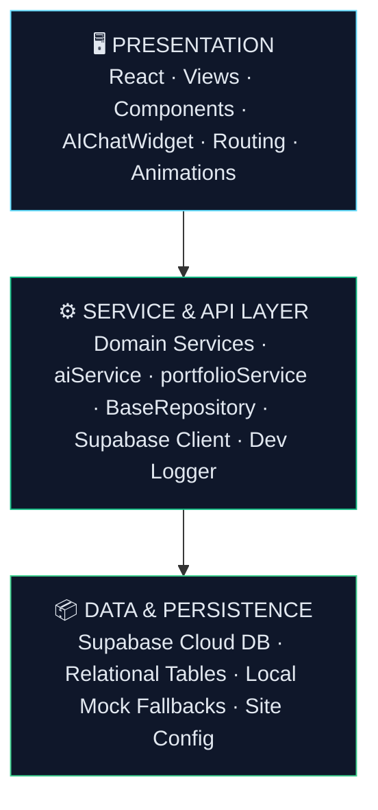
```mermaid
flowchart TD
    P["🖥️ PRESENTATION\nReact · Views · Components · AIChatWidget · Routing · Animations"]
    S["⚙️ SERVICE & API LAYER\nDomain Services · aiService · portfolioService · BaseRepository · Supabase Client · Dev Logger"]
    D["📦 DATA & PERSISTENCE\nSupabase Cloud DB · Relational Tables · Local Mock Fallbacks · Site Config"]

    P --> S --> D

    style P fill:#0f172a,stroke:#61DAFB,color:#e2e8f0
    style S fill:#0f172a,stroke:#10B981,color:#e2e8f0
    style D fill:#0f172a,stroke:#3ECF8E,color:#e2e8f0
```

**Core rule:** UI components must never access raw data or databases directly. All data flows strictly through domain services and repository abstractions.

---

### The Helper Layer

The helper layer provides interactive subsystems, developer utilities, and systemic UI feedback without violating the 3-tier boundary:

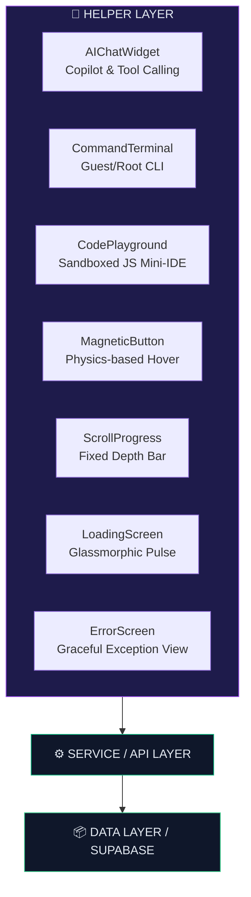
```mermaid
flowchart TD
    subgraph Helpers ["🧰 HELPER LAYER"]
        AI["AIChatWidget\nCopilot & Tool Calling"]
        CT["CommandTerminal\nGuest/Root CLI"]
        CP["CodePlayground\nSandboxed JS Mini-IDE"]
        MB["MagneticButton\nPhysics-based Hover"]
        SP["ScrollProgress\nFixed Depth Bar"]
        LS["LoadingScreen\nGlassmorphic Pulse"]
        ES["ErrorScreen\nGraceful Exception View"]
    end

    SVC["⚙️ SERVICE / API LAYER"]
    DATA["📦 DATA LAYER / SUPABASE"]

    Helpers --> SVC --> DATA

    style Helpers fill:#1e1b4b,stroke:#a855f7,color:#e2e8f0
    style SVC fill:#0f172a,stroke:#10B981,color:#e2e8f0
    style DATA fill:#0f172a,stroke:#3ECF8E,color:#e2e8f0
```

| Helper Component | File | Architectural Role |
| :--- | :--- | :--- |
| **AI Chat Widget** | `AIChatWidget.jsx` | Floating & full-screen AI copilot with dynamic token guard, tool calling, and strict scroll isolation |
| **Command Terminal** | `CommandTerminal.jsx` | Floating developer terminal with session auth, command history, and CLI tooling |
| **Code Playground** | `CodePlayground.jsx` | Isolated iframe JavaScript runner with console interception and `developerData` binding |
| **Magnetic Button** | `MagneticButton.jsx` | Framer Motion spring physics cursor attraction with radial ambient glow |
| **Scroll Progress** | `ScrollProgress.jsx` | Fixed top viewport progress tracker calculating dynamic document scroll depth |
| **Loading Screen** | `LoadingScreen.jsx` | Initial app hydration indicator with layout-aware glass skeleton sections and shimmer feedback |
| **Error Screen** | `ErrorScreen.jsx` | System-wide failure boundary if portfolio resolution fails |

---

### Layered Architecture & Execution Pipeline

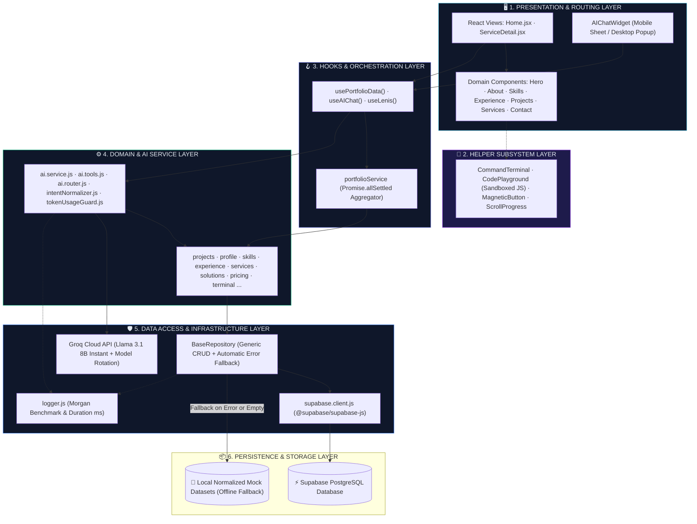
```mermaid
flowchart TD
    subgraph L1 ["🖥️ 1. PRESENTATION & ROUTING LAYER"]
        direction TB
        UI["React Views: Home.jsx · ServiceDetail.jsx"]
        COMPS["Domain Components: Hero · About · Skills · Experience · Projects · Services · Contact"]
        AIC["AIChatWidget (Mobile Sheet / Desktop Popup)"]
    end

    subgraph L2 ["🧰 2. HELPER SUBSYSTEM LAYER"]
        direction TB
        HELPERS["CommandTerminal · CodePlayground (Sandboxed JS) · MagneticButton · ScrollProgress"]
    end

    subgraph L3 ["🪝 3. HOOKS & ORCHESTRATION LAYER"]
        direction TB
        HOOK["usePortfolioData() · useAIChat() · useLenis()"]
        PSVC["portfolioService (Promise.allSettled Aggregator)"]
    end

    subgraph L4 ["⚙️ 4. DOMAIN & AI SERVICE LAYER"]
        direction TB
        AISVC["ai.service.js · ai.tools.js · ai.router.js · intentNormalizer.js · tokenUsageGuard.js"]
        DS["projects · profile · skills · experience · services · solutions · pricing · terminal ..."]
    end

    subgraph L5 ["🛡️ 5. DATA ACCESS & INFRASTRUCTURE LAYER"]
        direction TB
        REPO["BaseRepository (Generic CRUD + Automatic Error Fallback)"]
        LOG["logger.js (Morgan Benchmark & Duration ms)"]
        CLIENT["supabase.client.js (@supabase/supabase-js)"]
        GROQ["Groq Cloud API (Llama 3.1 8B Instant + Model Rotation)"]
    end

    subgraph L6 ["📦 6. PERSISTENCE & STORAGE LAYER"]
        direction TB
        DB[("⚡ Supabase PostgreSQL Database")]
        MOCK[("📁 Local Normalized Mock Datasets (Offline Fallback)")]
    end

    UI --> COMPS
    AIC --> HOOK
    COMPS -.-> HELPERS
    UI --> HOOK
    HOOK --> PSVC
    HOOK --> AISVC
    PSVC --> DS
    AISVC --> DS
    AISVC --> GROQ
    DS --> REPO
    REPO --> CLIENT --> DB
    REPO -->|"Fallback on Error or Empty"| MOCK
    REPO -.-> LOG
    AISVC -.-> LOG

    style L1 fill:#0f172a,stroke:#61DAFB,color:#e2e8f0
    style L2 fill:#1e1b4b,stroke:#a855f7,color:#e2e8f0
    style L3 fill:#0f172a,stroke:#818cf8,color:#e2e8f0
    style L4 fill:#0f172a,stroke:#10B981,color:#e2e8f0
    style L5 fill:#0f172a,stroke:#3b82f6,color:#e2e8f0
```

---

## 📦 Data & Database Architecture

The data layer is organized into **domain clusters** with foreign key constraints, cascading deletions (`ON DELETE CASCADE`), automated `updated_at` triggers, and performance B-Tree indexes.

### 🏛️ High-Level Domain Relationships

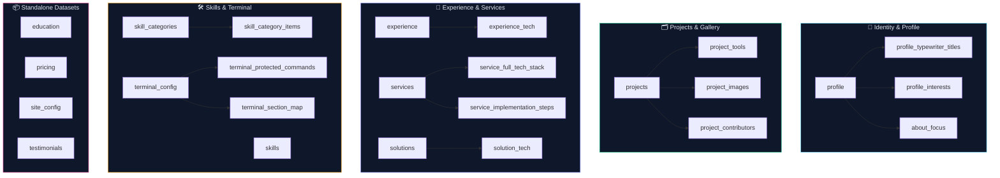
```mermaid
flowchart TD
    subgraph ProfileCluster ["👤 Identity & Profile"]
        PROFILE["profile"] --> TITLES["profile_typewriter_titles"]
        PROFILE --> INTERESTS["profile_interests"]
        PROFILE --> FOCUS["about_focus"]
    end

    subgraph ProjectsCluster ["🗂️ Projects & Gallery"]
        PROJECTS["projects"] --> TOOLS["project_tools"]
        PROJECTS --> IMGS["project_images"]
        PROJECTS --> CONTRIBS["project_contributors"]
    end

    subgraph CareerCluster ["💼 Experience & Services"]
        EXP["experience"] --> EXP_TECH["experience_tech"]
        SERV["services"] --> SERV_STACK["service_full_tech_stack"]
        SERV --> SERV_STEPS["service_implementation_steps"]
        SOL["solutions"] --> SOL_TECH["solution_tech"]
    end

    subgraph SkillsTerminalCluster ["🛠️ Skills & Terminal"]
        SKILL_CAT["skill_categories"] --> SKILL_ITEMS["skill_category_items"]
        SKILLS["skills"]
        TERM_CFG["terminal_config"] --> TERM_CMDS["terminal_protected_commands"]
        TERM_CFG --> TERM_MAP["terminal_section_map"]
    end

    subgraph StandaloneCluster ["📦 Standalone Datasets"]
        EDU["education"]
        PRICING["pricing"]
        SITE["site_config"]
        TESTIMONIALS["testimonials"]
    end

    style ProfileCluster fill:#0f172a,stroke:#61DAFB,color:#e2e8f0
    style ProjectsCluster fill:#0f172a,stroke:#10B981,color:#e2e8f0
    style CareerCluster fill:#0f172a,stroke:#818cf8,color:#e2e8f0
    style SkillsTerminalCluster fill:#0f172a,stroke:#F59E0B,color:#e2e8f0
    style StandaloneCluster fill:#0f172a,stroke:#EC4899,color:#e2e8f0
```

---

### 1️⃣ Identity & Profile Cluster ERD

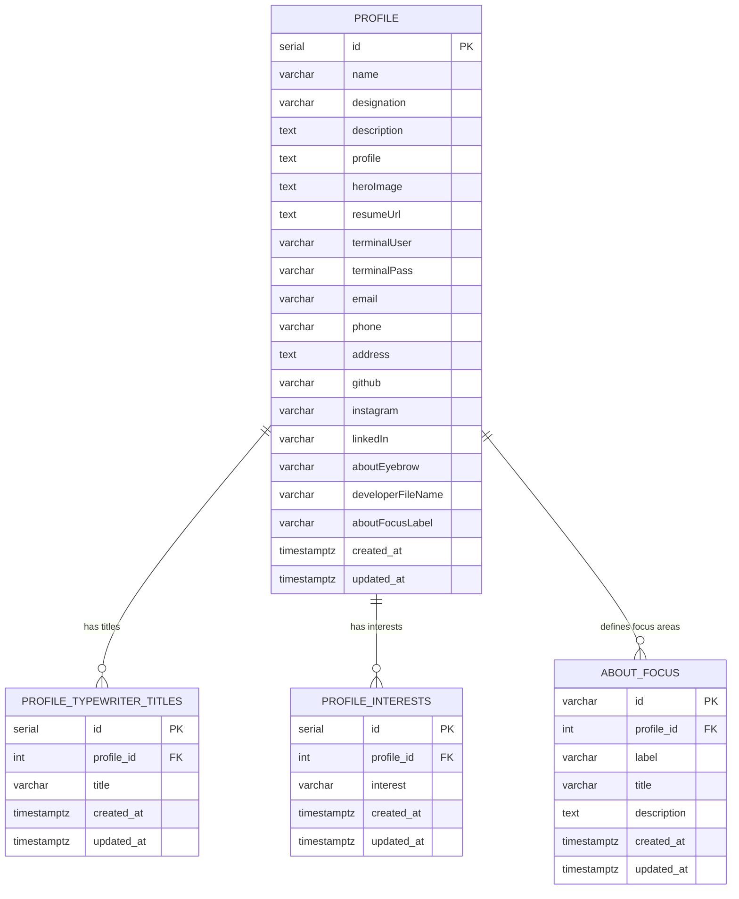
```mermaid
erDiagram
    PROFILE ||--o{ PROFILE_TYPEWRITER_TITLES : "has titles"
    PROFILE ||--o{ PROFILE_INTERESTS : "has interests"
    PROFILE ||--o{ ABOUT_FOCUS : "defines focus areas"

    PROFILE {
        serial id PK
        varchar name
        varchar designation
        text description
        text profile
        text heroImage
        text resumeUrl
        varchar terminalUser
        varchar terminalPass
        varchar email
        varchar phone
        text address
        varchar github
        varchar instagram
        varchar linkedIn
        varchar aboutEyebrow
        varchar developerFileName
        varchar aboutFocusLabel
        timestamptz created_at
        timestamptz updated_at
    }

    PROFILE_TYPEWRITER_TITLES {
        serial id PK
        int profile_id FK
        varchar title
        timestamptz created_at
        timestamptz updated_at
    }

    PROFILE_INTERESTS {
        serial id PK
        int profile_id FK
        varchar interest
        timestamptz created_at
        timestamptz updated_at
    }

    ABOUT_FOCUS {
        varchar id PK
        int profile_id FK
        varchar label
        varchar title
        text description
        timestamptz created_at
        timestamptz updated_at
    }
```

---

### 2️⃣ Projects & Gallery Cluster ERD

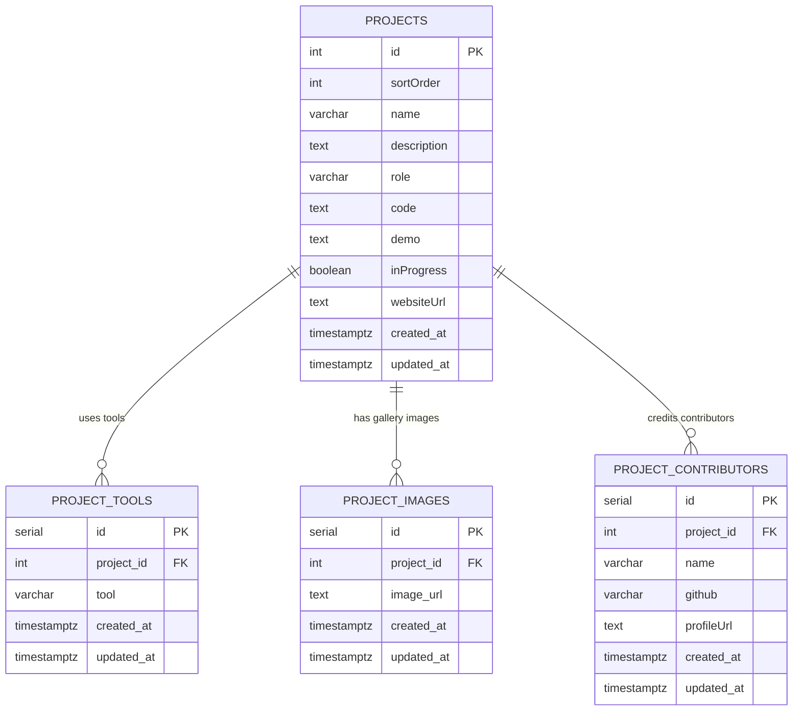
```mermaid
erDiagram
    PROJECTS ||--o{ PROJECT_TOOLS : "uses tools"
    PROJECTS ||--o{ PROJECT_IMAGES : "has gallery images"
    PROJECTS ||--o{ PROJECT_CONTRIBUTORS : "credits contributors"

    PROJECTS {
        int id PK
        int sortOrder
        varchar name
        text description
        varchar role
        text code
        text demo
        boolean inProgress
        text websiteUrl
        timestamptz created_at
        timestamptz updated_at
    }

    PROJECT_TOOLS {
        serial id PK
        int project_id FK
        varchar tool
        timestamptz created_at
        timestamptz updated_at
    }

    PROJECT_IMAGES {
        serial id PK
        int project_id FK
        text image_url
        timestamptz created_at
        timestamptz updated_at
    }

    PROJECT_CONTRIBUTORS {
        serial id PK
        int project_id FK
        varchar name
        varchar github
        text profileUrl
        timestamptz created_at
        timestamptz updated_at
    }
```

---

### 3️⃣ Experience, Services & Solutions Cluster ERD

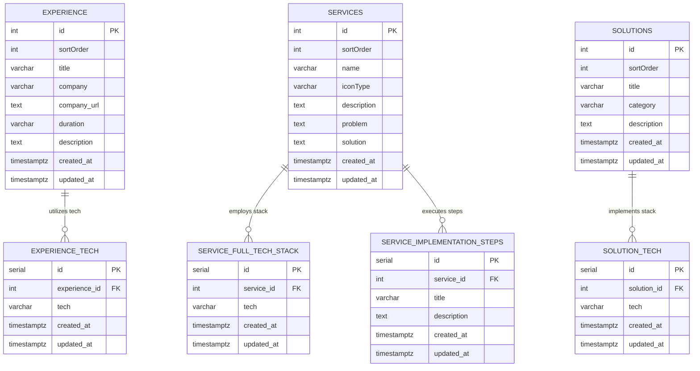
```mermaid
erDiagram
    EXPERIENCE ||--o{ EXPERIENCE_TECH : "utilizes tech"
    SERVICES ||--o{ SERVICE_FULL_TECH_STACK : "employs stack"
    SERVICES ||--o{ SERVICE_IMPLEMENTATION_STEPS : "executes steps"
    SOLUTIONS ||--o{ SOLUTION_TECH : "implements stack"

    EXPERIENCE {
        int id PK
        int sortOrder
        varchar title
        varchar company
        text company_url
        varchar duration
        text description
        timestamptz created_at
        timestamptz updated_at
    }

    EXPERIENCE_TECH {
        serial id PK
        int experience_id FK
        varchar tech
        timestamptz created_at
        timestamptz updated_at
    }

    SERVICES {
        int id PK
        int sortOrder
        varchar name
        varchar iconType
        text description
        text problem
        text solution
        timestamptz created_at
        timestamptz updated_at
    }

    SERVICE_FULL_TECH_STACK {
        serial id PK
        int service_id FK
        varchar tech
        timestamptz created_at
        timestamptz updated_at
    }

    SERVICE_IMPLEMENTATION_STEPS {
        serial id PK
        int service_id FK
        varchar title
        text description
        timestamptz created_at
        timestamptz updated_at
    }

    SOLUTIONS {
        int id PK
        int sortOrder
        varchar title
        varchar category
        text description
        timestamptz created_at
        timestamptz updated_at
    }

    SOLUTION_TECH {
        serial id PK
        int solution_id FK
        varchar tech
        timestamptz created_at
        timestamptz updated_at
    }
```

---

### 4️⃣ Skills Taxonomy & Terminal CLI ERD

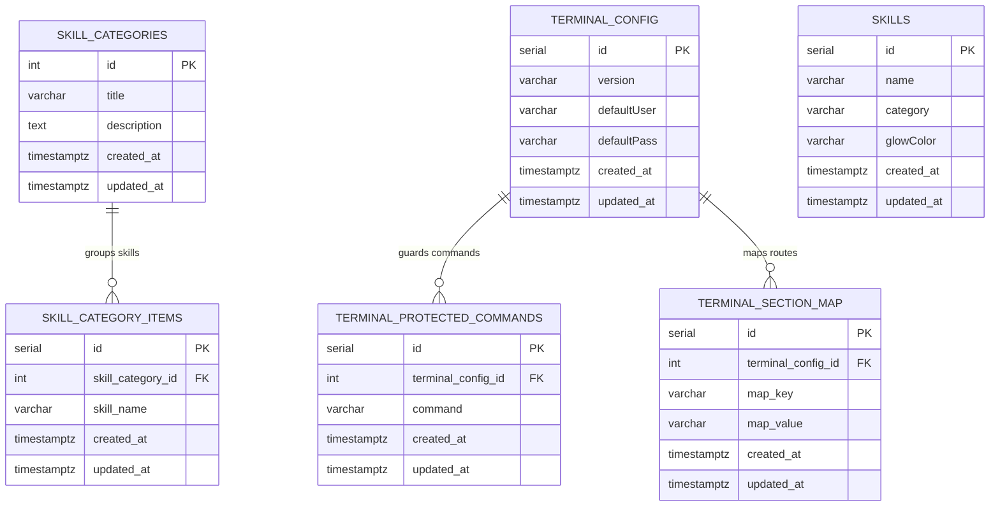
```mermaid
erDiagram
    SKILL_CATEGORIES ||--o{ SKILL_CATEGORY_ITEMS : "groups skills"
    TERMINAL_CONFIG ||--o{ TERMINAL_PROTECTED_COMMANDS : "guards commands"
    TERMINAL_CONFIG ||--o{ TERMINAL_SECTION_MAP : "maps routes"

    SKILL_CATEGORIES {
        int id PK
        varchar title
        text description
        timestamptz created_at
        timestamptz updated_at
    }

    SKILL_CATEGORY_ITEMS {
        serial id PK
        int skill_category_id FK
        varchar skill_name
        timestamptz created_at
        timestamptz updated_at
    }

    SKILLS {
        serial id PK
        varchar name
        varchar category
        varchar glowColor
        timestamptz created_at
        timestamptz updated_at
    }

    TERMINAL_CONFIG {
        serial id PK
        varchar version
        varchar defaultUser
        varchar defaultPass
        timestamptz created_at
        timestamptz updated_at
    }

    TERMINAL_PROTECTED_COMMANDS {
        serial id PK
        int terminal_config_id FK
        varchar command
        timestamptz created_at
        timestamptz updated_at
    }

    TERMINAL_SECTION_MAP {
        serial id PK
        int terminal_config_id FK
        varchar map_key
        varchar map_value
        timestamptz created_at
        timestamptz updated_at
    }
```

---

### 5️⃣ Standalone Entities ERD

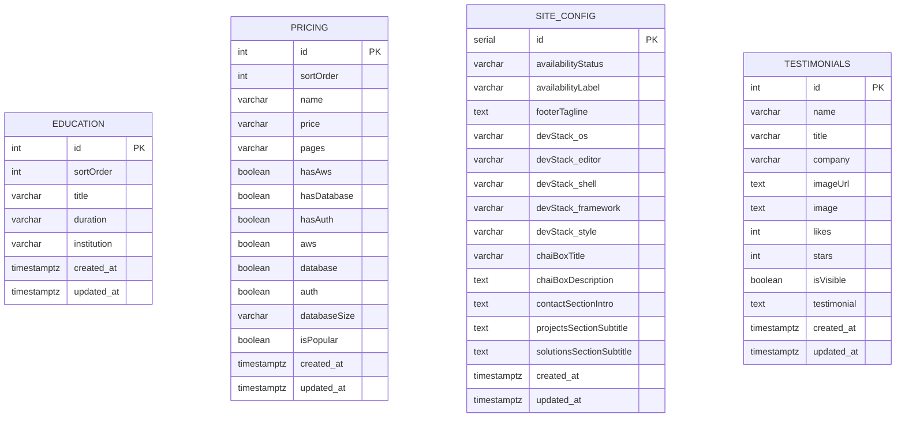
```mermaid
erDiagram
    EDUCATION {
        int id PK
        int sortOrder
        varchar title
        varchar duration
        varchar institution
        timestamptz created_at
        timestamptz updated_at
    }

    PRICING {
        int id PK
        int sortOrder
        varchar name
        varchar price
        varchar pages
        boolean hasAws
        boolean hasDatabase
        boolean hasAuth
        boolean aws
        boolean database
        boolean auth
        varchar databaseSize
        boolean isPopular
        timestamptz created_at
        timestamptz updated_at
    }

    SITE_CONFIG {
        serial id PK
        varchar availabilityStatus
        varchar availabilityLabel
        text footerTagline
        varchar devStack_os
        varchar devStack_editor
        varchar devStack_shell
        varchar devStack_framework
        varchar devStack_style
        varchar chaiBoxTitle
        text chaiBoxDescription
        text contactSectionIntro
        text projectsSectionSubtitle
        text solutionsSectionSubtitle
        timestamptz created_at
        timestamptz updated_at
    }

    TESTIMONIALS {
        int id PK
        varchar name
        varchar title
        varchar company
        text imageUrl
        text image
        int likes
        int stars
        boolean isVisible
        text testimonial
        timestamptz created_at
        timestamptz updated_at
    }
```

---

### 🏛️ Relational Domain Hierarchy

| Domain Cluster | Parent Table | Child Tables (1:N Cascading) | Key Schema Fields & Purpose |
|---|---|---|---|
| 👤 **Identity & Bio** | `profile` | `profile_typewriter_titles`<br/>`profile_interests`<br/>`about_focus` | Core developer details, bio, contacts, **`resumeUrl`**, credentials, and perspective focus models |
| 🗂️ **Projects Gallery** | `projects` | `project_tools`<br/>`project_images`<br/>`project_contributors` | Portfolio projects linked to multi-value tools, image galleries, and credited GitHub collaborators |
| 💼 **Career Timeline** | `experience` | `experience_tech` | Role history, durations, descriptions, and technology stack associations |
| 🧩 **Service Offerings** | `services` | `service_full_tech_stack`<br/>`service_implementation_steps` | Consulting offerings, implementation roadmaps, and full-stack requirements |
| 💡 **Case Solutions** | `solutions` | `solution_tech` | Problem/solution case studies with specific architectural tools |
| 🛠️ **Skill Taxonomy** | `skill_categories` / `skills` | `skill_category_items` | Categorized tech matrix, UI glow color mappings, and domain proficiencies |
| 🖥️ **Terminal CLI** | `terminal_config` | `terminal_protected_commands`<br/>`terminal_section_map` | Linux CLI configurations, root command security restrictions, and section navigation maps |
| 📦 **Standalone Records** | `education`<br/>`pricing`<br/>`site_config`<br/>`testimonials` | *Self-contained* | Academic history, pricing tiers, site-wide branding/copy, and peer testimonials |

---

### ⚡ Supabase Client & Repository Pattern

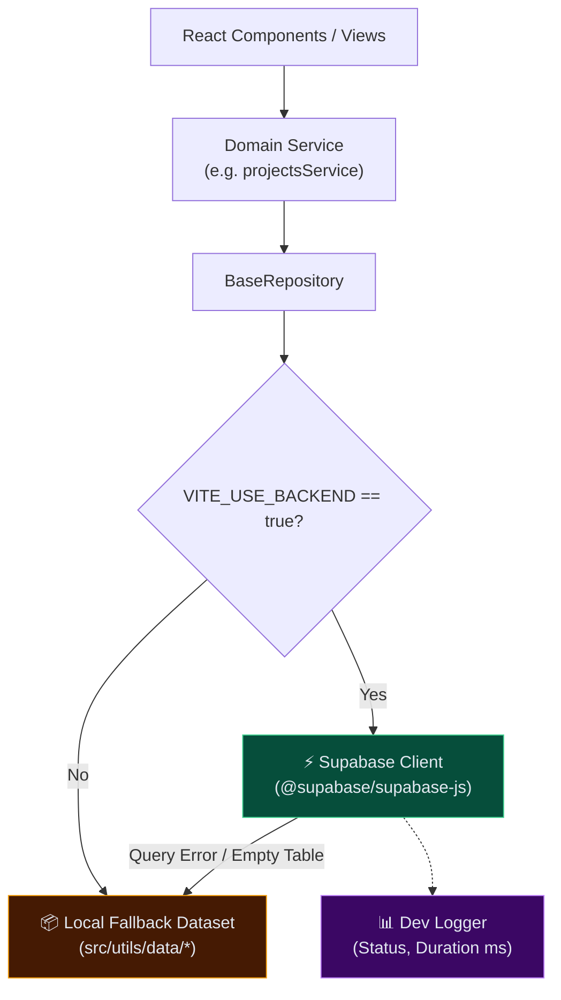
```mermaid
flowchart TD
    UI["React Components / Views"]
    SVC["Domain Service\n(e.g. projectsService)"]
    REPO["BaseRepository"]
    FLAG{"VITE_USE_BACKEND == true?"}
    SUPA["⚡ Supabase Client\n(@supabase/supabase-js)"]
    LOCAL["📦 Local Fallback Dataset\n(src/utils/data/*)"]
    LOG["📊 Dev Logger\n(Status, Duration ms)"]

    UI --> SVC --> REPO --> FLAG
    FLAG -- Yes --> SUPA
    FLAG -- No --> LOCAL
    SUPA -- "Query Error / Empty Table" --> LOCAL
    SUPA -.-> LOG

    style SUPA fill:#064e3b,stroke:#3ECF8E,color:#e2e8f0
    style LOCAL fill:#451a03,stroke:#F59E0B,color:#e2e8f0
    style LOG fill:#3b0764,stroke:#c084fc,color:#e2e8f0
```

---

## 🖥️ Interactive Terminal

A floating `CommandTerminal.jsx` provides a Linux-inspired developer interface, toggled via `Ctrl + \``.

### Capabilities

| Feature | Detail |
|---------|--------|
| 🔼 Command History | Up/Down arrow navigation through previous inputs |
| 📜 Auto-scroll | Output always scrolls to the latest log entry |
| 🔐 Session Auth | Masked password input with guest/root state management |
| ⌨️ Keyboard-first | Fully navigable via keyboard, no mouse required |
| 📱 Mobile-safe | Usable on small screens without layout breakage |
| 📐 Responsive sizing | Left-anchored panel with viewport-constrained width and height across devices |

### Protected Commands

These commands require an active root session:

```
health    check    siteconfig    matrix    sudo hire    coffee
```

### Authentication Flow

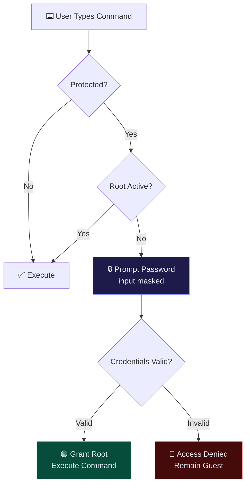
```mermaid
flowchart TD
    CMD["⌨️ User Types Command"]
    PROT{"Protected?"}
    EXEC["✅ Execute"]
    ROOT{"Root Active?"}
    PASS["🔒 Prompt Password\ninput masked"]
    VALID{"Credentials Valid?"}
    GRANT["🟢 Grant Root\nExecute Command"]
    DENY["🔴 Access Denied\nRemain Guest"]

    CMD --> PROT
    PROT -- No --> EXEC
    PROT -- Yes --> ROOT
    ROOT -- Yes --> EXEC
    ROOT -- No --> PASS --> VALID
    VALID -- Valid --> GRANT
    VALID -- Invalid --> DENY

    style GRANT fill:#064e3b,stroke:#10B981,color:#e2e8f0
    style DENY fill:#450a0a,stroke:#ef4444,color:#e2e8f0
    style PASS fill:#1e1b4b,stroke:#818cf8,color:#e2e8f0
```

### Credential Retrieval Path

Credentials are never hardcoded in the presentation layer. They are retrieved through the standard service chain:

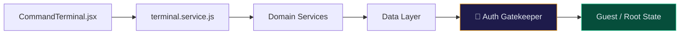
```mermaid
flowchart LR
    T["CommandTerminal.jsx"]
    TS["terminal.service.js"]
    PDS["Domain Services"]
    DL["Data Layer"]
    AG["🔑 Auth Gatekeeper"]
    SESS["Guest / Root State"]

    T --> TS --> PDS --> DL --> AG --> SESS

    style AG fill:#1e1b4b,stroke:#F59E0B,color:#e2e8f0
    style SESS fill:#064e3b,stroke:#10B981,color:#e2e8f0
```

### Session Lifecycle

| State | Description |
|-------|-------------|
| 🟡 Guest | Public commands only, no privileges |
| 🔵 Authenticating | Password prompt active, input fully masked |
| 🟢 Root | All protected commands available |

| Command | Behavior |
|---------|----------|
| `logout` | Revoke root → clear auth state → return to Guest (terminal stays open) |
| `exit` | Revoke root → clear auth state → close terminal |

> [!WARNING]
> Terminal authentication is an **interactive portfolio feature only**, not a real authorization mechanism. Privileged operations must always be enforced server-side. Never place production credentials in frontend source code.

---

## 💻 About & Sandboxed Code Playground

The About section (`src/components/about/About.jsx`) incorporates an interactive developer workspace and dual-mode mini IDE:

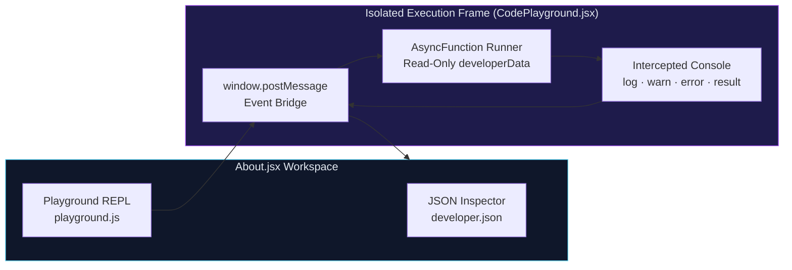
```mermaid
flowchart LR
    subgraph UI ["About.jsx Workspace"]
        TAB1["JSON Inspector\ndeveloper.json"]
        TAB2["Playground REPL\nplayground.js"]
    end

    subgraph Sandbox ["Isolated Execution Frame (CodePlayground.jsx)"]
        POST["window.postMessage\nEvent Bridge"]
        ASYNC["AsyncFunction Runner\nRead-Only developerData"]
        CONSOLE["Intercepted Console\nlog · warn · error · result"]
    end

    TAB2 --> POST --> ASYNC --> CONSOLE --> POST --> UI

    style UI fill:#0f172a,stroke:#61DAFB,color:#e2e8f0
    style Sandbox fill:#1e1b4b,stroke:#a855f7,color:#e2e8f0
```

### Key Capabilities

- **Dual-Mode Code Viewer:**
  - **`developer.json` Mode:** Syntax-highlighted JSON view with tokenized keys, strings, booleans, and numbers, single-click clipboard copy, and collapsible accordion.
  - **`playground.js` Mode:** Live JavaScript scratchpad powered by `react-simple-code-editor` and `prismjs` VS Code Dark+ theme.
- **Iframe Sandboxed Execution:** User code executes safely inside an `iframe` sandbox (`allow-scripts allow-same-origin`) using dynamic `AsyncFunction`. Host globals (`window`, `document`, `localStorage`, `parent`) are neutralized.
- **Simulated Console Output:** Output from `console.log`, `console.warn`, `console.error`, and evaluated return expressions are piped to a custom terminal output pane.
- **Engineering Perspectives Carousel:** Interactive tabbed philosophy selector (`aboutFocus`) with active indicator pagination.
- **Interactive Profile Card:** Avatar skeleton loading pulse, live availability ping badge, and copyable contact chips.

---

## 📁 Project Structure

```
📂 apps/
└── 📂 ego-web/
    ├── 📂 src/
    │   ├── 📄 App.jsx                    # Application root, loading state & view transitions
    │   ├── 📄 main.jsx                   # React DOM bootstrap
    │   │
    │   ├── 📂 api/                       # Centralized API & Service Layer
    │   │   ├── 📄 portfolio.service.js   # Promise.allSettled domain aggregator
    │   │   │
    │   │   ├── 📂 ai/                    # AI Copilot & Multi-Turn Tool Calling Engine
    │   │   │   ├── 📄 ai.config.js       # Groq model configs & jolly copilot system prompt
    │   │   │   ├── 📄 ai.service.js      # Groq loop, backend proxy, local fallback synthesis
    │   │   │   ├── 📄 ai.tools.js        # Centralized read-only tool registry (11 domain mappings)
    │   │   │   ├── 📄 ai.router.js       # Intent detection & heuristic local-fallback tool routing
    │   │   │   ├── 📄 intentNormalizer.js # Typo / slang normalizer (re-exports detectIntentTool)
    │   │   │   └── 📄 tokenUsageGuard.js # Session token guardrail & capacity tracker
    │   │   │
    │   │   ├── 📂 core/                  # Infrastructure & data clients
    │   │   │   ├── 📄 apiClient.js       # Axios HTTP client instance
    │   │   │   ├── 📄 base.repository.js # Supabase generic CRUD with fallback
    │   │   │   ├── 📄 logger.js          # Custom Morgan-style colored dev logger
    │   │   │   └── 📄 supabase.client.js # @supabase/supabase-js client
    │   │   │
    │   │   └── 📂 services/              # Domain services (Strict Read-Only access for AI)
    │   │       ├── 📄 contact.service.js
    │   │       ├── 📄 education.service.js
    │   │       ├── 📄 experience.service.js # Experience data with company URL normalization
    │   │       ├── 📄 github.service.js    # Live GitHub metrics, language totals & activity aggregator
    │   │       ├── 📄 gmail.service.js     # Direct mail dispatch handler
    │   │       ├── 📄 offerings.service.js
    │   │       ├── 📄 pricing.service.js
    │   │       ├── 📄 profile.service.js
    │   │       ├── 📄 projects.service.js  # Relational joins (tools, images, contributors)
    │   │       ├── 📄 site.service.js
    │   │       ├── 📄 skills.service.js
    │   │       ├── 📄 solutions.service.js
    │   │       ├── 📄 terminal.service.js
    │   │       └── 📄 testimonials.service.js
    │   │
    │   ├── 📂 components/                # Presentation UI Components
    │   │   ├── 📂 helper/                # Interactive helper subsystem
    │   │   │   ├── 💻 AIChatWidget.jsx   # Responsive full-screen mobile sheet & desktop AI popup
    │   │   │   ├── 💻 CodePlayground.jsx # In-browser sandboxed JS mini-IDE
    │   │   │   ├── 💻 CommandTerminal.jsx # Interactive developer terminal
    │   │   │   ├── 💻 ErrorScreen.jsx    # Graceful error boundary screen
    │   │   │   ├── 💻 LoadingScreen.jsx  # Responsive glass skeleton page during data fetch
    │   │   │   ├── 💻 MagneticButton.jsx # Spring-physics magnetic hover button
    │   │   │   └── 💻 ScrollProgress.jsx # RAF-throttled fixed scroll progress tracker
    │   │   │
    │   │   ├── 📂 about/                 # About section, mini IDE & GitHubStatsBanner
    │   │   │   ├── 💻 About.jsx
    │   │   │   └── 💻 GitHubStatsBanner.jsx # Live GitHub stats glassmorphic banner
    │   │   ├── 📂 common/                # Shared components
    │   │   │   └── 💻 MetaTags.jsx
    │   │   ├── 📂 contact/               # Contact form with EmailJS integration
    │   │   │   └── 💻 Contact.jsx
    │   │   ├── 📂 education/             # Academic timeline
    │   │   │   └── 💻 Education.jsx
    │   │   ├── 📂 experience/            # Work history timeline & company links
    │   │   │   └── 💻 Experience.jsx
    │   │   ├── 📂 footer/                # Footer and social links
    │   │   │   └── 💻 Footer.jsx
    │   │   ├── 📂 header/                # Hero section with typewriter effect
    │   │   │   └── 💻 Header.jsx
    │   │   ├── 📂 nav/                   # Floating navigation dock
    │   │   │   └── 💻 Nav.jsx
    │   │   ├── 📂 projects/              # Asymmetrical bento grid & GitHub avatars
    │   │   │   └── 💻 Projects.jsx
    │   │   ├── 📂 services/              # Service cards & investment tiers
    │   │   │   └── 💻 Services.jsx
    │   │   ├── 📂 sidebar/               # Social floating sidebar icons
    │   │   │   └── 💻 socialcons.jsx
    │   │   ├── 📂 skills/                # Categorized tech stack matrix
    │   │   │   └── 💻 Skills.jsx
    │   │   ├── 📂 solutions/             # Engineering solutions showcase
    │   │   │   └── 💻 Solutions.jsx
    │   │   └── 📂 testimonials/          # Client & peer testimonials
    │   │       └── 💻 Testimonials.jsx
    │   │
    │   ├── 📂 layout/                    # Shared layouts & shell routing
    │   │   └── 💻 AppLayout.jsx          # Shared shell, routes & global helpers
    │   │
    │   ├── 📂 hooks/                     # Custom React Application Hooks
    │   │   ├── 🪝 useAIChat.js           # AI Copilot conversation state, unread badges & tokens
    │   │   ├── 🪝 useExperience.js       # Normalizes company_url/companyUrl fields
    │   │   ├── 🪝 useGitHubStats.js      # GitHub metrics state, refresh & unmount safety
    │   │   ├── 🪝 useLenis.js            # Lenis scroll with device/reduced-motion guards
    │   │   └── 🪝 usePortfolioData.js    # Central portfolio fetcher with unmount guards
    │   │
    │   ├── 📂 styles/                    # Application Stylesheets
    │   │   ├── 🎨 index.css              # Global Tailwind styles & CSS variables
    │   │   └── 🎨 prism-vsc-dark-plus.css # VS Code Dark+ theme for PrismJS
    │   │
    │   ├── 📂 utils/                     # Helpers, Assets, and Mock Data
    │   │   ├── 📄 github.js              # GitHub avatar CDN URL builder
    │   │   ├── 📂 images/                # Skill icon resolvers
    │   │   └── 📂 data/                  # Normalized local mock & fallback datasets
    │   │       ├── 📄 contactsData.js
    │   │       ├── 📄 educations.js
    │   │       ├── 📄 experience-data.js
    │   │       ├── 📄 personal-data.js
    │   │       ├── 📄 plan-data.js
    │   │       ├── 📄 projects-data.js
    │   │       ├── 📄 services-data.js
    │   │       ├── 📄 site-config.js
    │   │       ├── 📄 skill-catagories.js
    │   │       ├── 📄 skills.js
    │   │       ├── 📄 solutionsData.js
    │   │       ├── 📄 terminalData.js
    │   │       └── 📄 testem-data.js
    │   │
    │   ├── 📂 Assets/                    # Visual assets used by portfolio sections
    │   │   ├── 📂 images/                # Profile and content images
    │   │   ├── 📂 lottie/                # JSON animation assets
    │   │   └── 📂 svg/skills/             # Technology skill icons
    │   │
    │   └── 📂 views/                     # Page Views & Routes
    │       ├── 💻 Home.jsx               # Main single-page portfolio view
    │       └── 💻 ServiceDetail.jsx      # Detailed service route
    │
    ├── 📦 public/                        # Static web assets directory
    ├── 🌐 index.html                     # Vite HTML entry point
    ├── 📜 package.json                   # Node package configuration manifest
    ├── 🎨 postcss.config.js              # PostCSS plugin configuration
    ├── 🎨 tailwind.config.js             # Tailwind theme and content configuration
    ├── ⚡ vite.config.js                 # Vite compiler and bundler setup
    └── 🚀 netlify.toml                   # Netlify hosting deployment configuration
```

---

## 🔌 External Integrations & Libraries

All external services and heavy utility libraries are cleanly isolated behind the service or helper layers:

| Integration | Abstracted Through | Purpose |
|-------------|-------------------|---------|
| ⚡ Supabase | `api/core/supabase.client.js` & `base.repository.js` | Cloud PostgreSQL database queries & live portfolio persistence |
| 🤖 Groq Cloud AI | `api/ai/ai.service.js`, `ai.tools.js`, `ai.router.js` | Multi-model Groq tool-calling, centralized domain tools, and offline heuristic routing |
| 🌐 Axios | `api/core/apiClient.js` | Generic HTTP client for custom endpoints |
| 📧 EmailJS | `contact.service.js` | Serverless contact form submission |
| 💻 PrismJS & Code Editor | `CodePlayground.jsx` & `About.jsx` | In-browser syntax highlighting and code editing |
| 🍞 React Hot Toast | UI layer | Floating feedback notifications |
| 🔍 React Helmet Async | `MetaTags.jsx` | Dynamic per-route SEO head metadata |
| 📜 Lenis | `useLenis.js` | Physics-based smooth momentum scrolling |
| 🐙 GitHub CDN | `utils/github.js` | Dynamic profile avatar resolution for contributors |

---

## ✨ UI / UX & Performance

### Design Stack

| Element | Technology |
|---------|-----------|
| 🎨 Styling | Tailwind CSS 3.x |
| 🎬 Animations | Framer Motion |
| 📜 Smooth Scroll | Lenis |
| ⚛️ Framework | React 18 |
| 🚀 Build | Vite |
| 🗺️ Routing | React Router DOM |

Design language: dark modern · glassmorphism surfaces · strong typography · cinematic transitions · layered visual depth.

### Performance Principles

- **Stable loading geometry** — Skeleton placeholders reserve section space while asynchronous portfolio and GitHub data is fetched, reducing cumulative layout shift.
- **Low-overhead scrolling** — Passive scroll listeners batch state updates into animation frames, while viewport reveals run once with buffered margins.
- **Smooth state replacement** — The initial skeleton-to-application transition uses a short opacity fade rather than an abrupt DOM swap.

| Approach | Detail |
|----------|--------|
| ⚡ Vite build | Tree-shaking and code splitting by default |
| 🔄 Concurrent data | `Promise.allSettled` across all domain services |
| 🧠 Memoization | Only applied where render cost clearly justifies it |
| 🛣️ Lazy routes | Applied where appropriate for initial load speed |
| 🖼️ Optimized images | Compressed, correct formats |
| 🎞️ Safe animations | Never compromise usability or cause layout thrash |

---

## 🛡️ Security

| Practice | Applied Where |
|----------|--------------|
| 🔒 No hardcoded credentials | Terminal uses service-driven credential retrieval |
| 🚫 No real secrets in source | Sensitive values live in `.env` only |
| ✅ Input validation | Contact form validated before any submission |
| 🧹 No unsafe HTML injection | Dynamic content sanitized at render |
| 🗃️ No sensitive browser storage | Auth state lives in React state only (never localStorage) |
| ⚠️ Client auth = feature only | Clearly scoped; real authorization must be server-side |

---

## ♿ Accessibility & 📱 Responsive Design

**Responsive:** Full support from 320px mobile to wide desktop. The terminal remains usable on small screens with no horizontal overflow, broken layouts, or overlapping UI elements.

**Accessible:** Semantic HTML, full keyboard navigation, visible focus states, ARIA attributes, sufficient contrast, and reduced-motion consideration throughout. The terminal is fully keyboard-accessible.

---

## 📬 Contact System

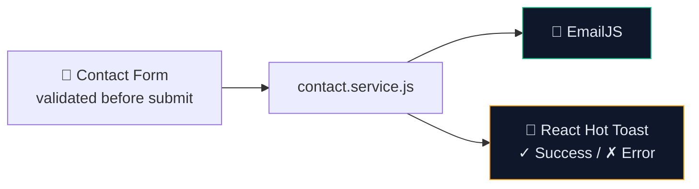
```mermaid
flowchart LR
    FORM["📝 Contact Form\nvalidated before submit"]
    SVC["contact.service.js"]
    EJS["📧 EmailJS"]
    TOAST["🍞 React Hot Toast\n✓ Success / ✗ Error"]

    FORM --> SVC --> EJS
    SVC --> TOAST

    style EJS fill:#0f172a,stroke:#10B981,color:#e2e8f0
    style TOAST fill:#0f172a,stroke:#F59E0B,color:#e2e8f0
```

EmailJS logic is fully contained in `contact.service.js`. The React component only calls the service and handles the toast response.

---

## 🤖 Ego Copilot & AI Architecture Subsystem

Ego Web features an interactive, production-grade AI architectural assistant (**Ego Copilot**) integrated into the presentation and service layers. Rather than a static mock chatbot, Ego Copilot executes **live multi-turn function/tool calling** against the portfolio's domain services, allowing visitors and technical recruiters to converse directly with an AI copilot about Haider's engineering background, .NET stack, projects, and system architectures.

The AI folder is split by responsibility so orchestration, routing, and domain retrieval stay independent:

| Concern | Module | Does not own |
| :--- | :--- | :--- |
| Conversation I/O & Groq / proxy / synthesis | `ai.service.js` | Intent regex, domain queries |
| Typo / slang mapping | `intentNormalizer.js` | Tool selection, LLM calls |
| Intent + local heuristic tool routing | `ai.router.js` | Markdown persona, Groq HTTP |
| Read-only domain adapters + Groq schemas | `ai.tools.js` (single registry) | Chat UI, intent regex |
| Persona, model list, anti-table / anti-JSON-dump rules | `ai.config.js` | Tool execution |
| Session capacity circuit breaker | `tokenUsageGuard.js` | Tool payloads |

`ai.tools.js` remains a **centralized registry** (not split per domain). Domain data still flows only through existing services. Groq and the local fallback both consume `executeAITool()` JSON; Ego’s upbeat card layout is produced by the system prompt (live path) or `executeLocalAgentFallback` (offline path)—never by dumping raw JSON or markdown tables.

---

### 🔄 Multi-Turn Tool Execution & Sequence Flow

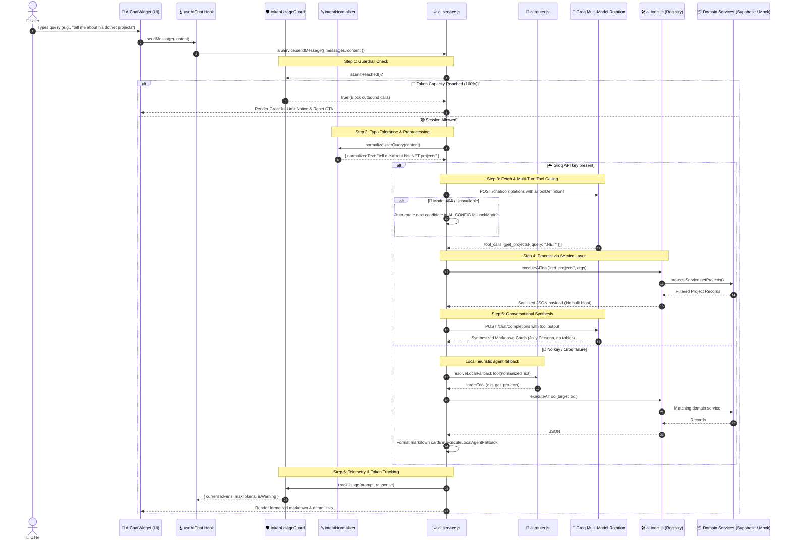
```mermaid
sequenceDiagram
    autonumber
    actor U as 👤 User
    participant W as 📱 AIChatWidget (UI)
    participant H as 🪝 useAIChat Hook
    participant G as 🛡️ tokenUsageGuard
    participant N as 🔤 intentNormalizer
    participant S as ⚙️ ai.service.js
    participant R as 🧭 ai.router.js
    participant M as 🔄 Groq Multi-Model Rotation
    participant T as 🛠️ ai.tools.js (Registry)
    participant DS as 📦 Domain Services (Supabase / Mock)

    U->>W: Types query (e.g., "tell me about his dotnet projects")
    W->>H: sendMessage(content)
    H->>S: aiService.sendMessage({ messages, content })

    Note over S,G: Step 1: Guardrail Check
    S->>G: isLimitReached()?
    alt 🛑 Token Capacity Reached (100%)
        G-->>S: true (Block outbound calls)
        S-->>W: Render Graceful Limit Notice & Reset CTA
    else 🟢 Session Allowed
        Note over S,N: Step 2: Typo Tolerance & Preprocessing
        S->>N: normalizeUserQuery(content)
        N-->>S: { normalizedText: "tell me about his .NET projects" }

        alt ☁️ Groq API key present
            Note over S,M: Step 3: Fetch & Multi-Turn Tool Calling
            S->>M: POST /chat/completions with aiToolDefinitions
            alt 🔄 Model 404 / Unavailable
                S->>S: Auto-rotate next candidate in AI_CONFIG.fallbackModels
            end
            M-->>S: tool_calls: [get_projects({ query: ".NET" })]

            Note over S,T: Step 4: Process via Service Layer
            S->>T: executeAITool("get_projects", args)
            T->>DS: projectsService.getProjects()
            DS-->>T: Filtered Project Records
            T-->>S: Sanitized JSON payload (No bulk bloat)

            Note over S,M: Step 5: Conversational Synthesis
            S->>M: POST /chat/completions with tool output
            M-->>S: Synthesized Markdown Cards (Jolly Persona, no tables)
        else 📁 No key / Groq failure
            Note over S,R: Local heuristic agent fallback
            S->>R: resolveLocalFallbackTool(normalizedText)
            R-->>S: targetTool (e.g. get_projects)
            S->>T: executeAITool(targetTool)
            T->>DS: Matching domain service
            DS-->>T: Records
            T-->>S: JSON
            S->>S: Format markdown cards in executeLocalAgentFallback
        end

        Note over S,G: Step 6: Telemetry & Token Tracking
        S->>G: trackUsage(prompt, response)
        G-->>H: { currentTokens, maxTokens, isWarning }
        S-->>W: Render formatted markdown & demo links
    end
```

---

### 🏗️ Subsystem Component Architecture

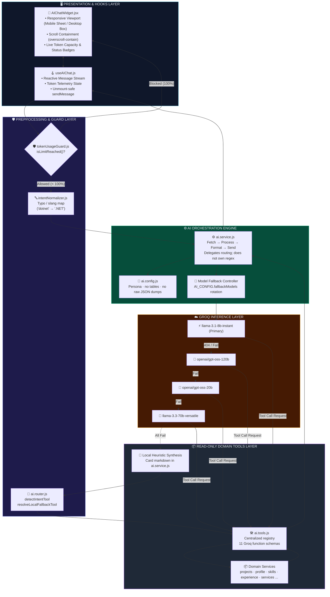
```mermaid
flowchart TD
    subgraph UI_LAYER ["🖥️ PRESENTATION & HOOKS LAYER"]
        WIDGET["📱 AIChatWidget.jsx\n• Responsive Viewport (Mobile Sheet / Desktop Box)\n• Scroll Containment (overscroll-contain)\n• Live Token Capacity & Status Badges"]
        HOOK["🪝 useAIChat.js\n• Reactive Message Stream\n• Token Telemetry State\n• Unmount-safe sendMessage"]
        WIDGET <--> HOOK
    end

    subgraph PRE_PROCESS ["🛡️ PREPROCESSING & GUARD LAYER"]
        GUARD{"🛡️ tokenUsageGuard.js\nisLimitReached()?"}
        NORM["🔤 intentNormalizer.js\nTypo / slang map\n('dotnet' → '.NET')"]
        ROUTER["🧭 ai.router.js\ndetectIntentTool\nresolveLocalFallbackTool"]
    end

    subgraph ENGINE ["⚙️ AI ORCHESTRATION ENGINE"]
        SVC["⚙️ ai.service.js\nFetch → Process → Format → Send\nDelegates routing; does not own regex"]
        ROTATOR["🔄 Model Fallback Controller\nAI_CONFIG.fallbackModels rotation"]
        CFG["📜 ai.config.js\nPersona · no tables · no raw JSON dumps"]
    end

    subgraph LLM_CLOUD ["☁️ GROQ INFERENCE LAYER"]
        GROQ1["⚡ llama-3.1-8b-instant (Primary)"]
        GROQ2["🧩 openai/gpt-oss-120b"]
        GROQ3["🧩 openai/gpt-oss-20b"]
        GROQ4["🧠 llama-3.3-70b-versatile"]
    end

    subgraph TOOLS_DATA ["📦 READ-ONLY DOMAIN TOOLS LAYER"]
        REGISTRY["🛠️ ai.tools.js\nCentralized registry\n11 Groq function schemas"]
        DOMAIN["📦 Domain Services\nprojects · profile · skills · experience · services ..."]
        OFFLINE["📁 Local Heuristic Synthesis\nCard markdown in ai.service.js"]
    end

    HOOK --> GUARD
    GUARD -- "Allowed (< 100%)" --> NORM --> SVC
    GUARD -- "Blocked (100%)" --> WIDGET
    SVC --> CFG
    SVC --> ROTATOR
    ROTATOR --> GROQ1
    GROQ1 -. "404 / Fail" .-> GROQ2 -. "Fail" .-> GROQ3 -. "Fail" .-> GROQ4 -. "All Fail" .-> OFFLINE
    GROQ1 & GROQ2 & GROQ3 & GROQ4 -- "Tool Call Request" --> REGISTRY
    OFFLINE --> ROUTER
    ROUTER --> REGISTRY
    REGISTRY --> DOMAIN
    DOMAIN --> REGISTRY --> SVC
    SVC --> HOOK

    style UI_LAYER fill:#0f172a,stroke:#61DAFB,color:#e2e8f0
    style PRE_PROCESS fill:#1e1b4b,stroke:#818cf8,color:#e2e8f0
    style ENGINE fill:#064e3b,stroke:#10B981,color:#e2e8f0
    style LLM_CLOUD fill:#451a03,stroke:#F59E0B,color:#e2e8f0
    style TOOLS_DATA fill:#1f2937,stroke:#a855f7,color:#e2e8f0
```

---

### 🧭 Intent Router vs Centralized Tool Registry

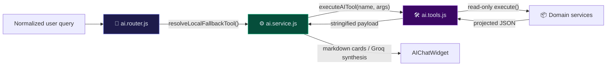
```mermaid
flowchart LR
    Q["Normalized user query"]
    R["🧭 ai.router.js"]
    S["⚙️ ai.service.js"]
    T["🛠️ ai.tools.js"]
    D["📦 Domain services"]

    Q --> R
    R -->|"resolveLocalFallbackTool()"| S
    S -->|"executeAITool(name, args)"| T
    T -->|"read-only execute()"| D
    D -->|"projected JSON"| T
    T -->|"stringified payload"| S
    S -->|"markdown cards / Groq synthesis"| UI["AIChatWidget"]

    style R fill:#1e1b4b,stroke:#818cf8,color:#e2e8f0
    style T fill:#3b0764,stroke:#c084fc,color:#e2e8f0
    style S fill:#064e3b,stroke:#10B981,color:#e2e8f0
```

**Boundary:** `ai.router.js` only decides *which* tool to run on the offline path. `ai.tools.js` is the single registry Groq uses (`aiToolDefinitions`) and the only place domain executors are mapped. Do not split executors into per-domain files unless the registry still remains the sole Groq/schema source.

---

### 🔄 Auto-Selecting Multi-Model Fallback Hierarchy

To guarantee zero downtime and resilient uptime during cloud outages or model deprecation, `ai.service.js` rotates through `AI_CONFIG.fallbackModels` and then the local heuristic agent:


```mermaid
flowchart LR
    M1["⚡ Primary\nllama-3.1-8b-instant"]
    M2["🧩 Backup 1\nopenai/gpt-oss-120b"]
    M3["🧩 Backup 2\nopenai/gpt-oss-20b"]
    M4["🧠 Backup 3\nllama-3.3-70b-versatile"]
    M5["📁 Offline Agent\nai.router + executeAITool\n+ card synthesis"]

    M1 -->|"404 / Model Error"| M2
    M2 -->|"404 / Model Error"| M3
    M3 -->|"404 / Model Error"| M4
    M4 -->|"All API Outages"| M5

    style M1 fill:#064e3b,stroke:#10B981,color:#e2e8f0
    style M2 fill:#0f172a,stroke:#38BDF8,color:#e2e8f0
    style M3 fill:#1e1b4b,stroke:#818cf8,color:#e2e8f0
    style M4 fill:#451a03,stroke:#F59E0B,color:#e2e8f0
    style M5 fill:#3b0764,stroke:#c084fc,color:#e2e8f0
```

---

### ⚡ Session Token Guardrail Lifecycle

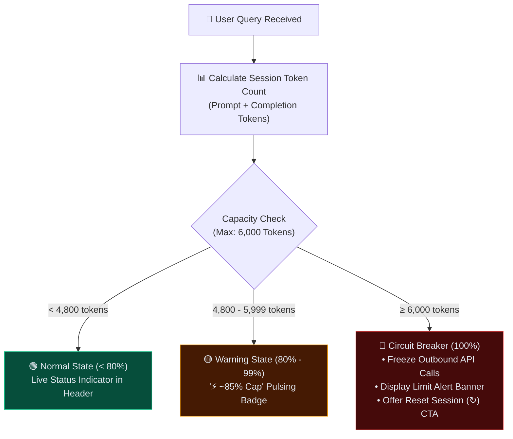
```mermaid
flowchart TD
    REQ["💬 User Query Received"]
    ACC["📊 Calculate Session Token Count\n(Prompt + Completion Tokens)"]
    CHECK{"Capacity Check\n(Max: 6,000 Tokens)"}
    
    OK["🟢 Normal State (< 80%)\nLive Status Indicator in Header"]
    WARN["🟡 Warning State (80% - 99%)\n'⚡ ~85% Cap' Pulsing Badge"]
    BLOCK["🛑 Circuit Breaker (100%)\n• Freeze Outbound API Calls\n• Display Limit Alert Banner\n• Offer Reset Session (↻) CTA"]

    REQ --> ACC --> CHECK
    CHECK -- "< 4,800 tokens" --> OK
    CHECK -- "4,800 - 5,999 tokens" --> WARN
    CHECK -- "≥ 6,000 tokens" --> BLOCK

    style OK fill:#064e3b,stroke:#10B981,color:#e2e8f0
    style WARN fill:#451a03,stroke:#F59E0B,color:#e2e8f0
    style BLOCK fill:#450a0a,stroke:#EF4444,color:#e2e8f0
```

---

### 🏛️ Key AI Subsystem Modules

| Module | File Path | Architectural Responsibility |
| :--- | :--- | :--- |
| **Presentation Widget** | `src/components/helper/AIChatWidget.jsx` | Full-screen mobile sheet & desktop floating card with strict scroll isolation (`overscroll-contain`) and safe-area padding |
| **State Orchestrator** | `src/hooks/useAIChat.js` | Message lifecycle, unread badges, open/close toggles, token usage state, unmount safety, and session reset |
| **Service Pipeline** | `src/api/ai/ai.service.js` | `Fetch → Process → Format → Send` engine: Groq tool loop, backend proxy, local card synthesis. Delegates routing to `ai.router.js` |
| **Intent Router** | `src/api/ai/ai.router.js` | `detectIntentTool` + `resolveLocalFallbackTool` heuristic routing. Owns the regex that used to live in `AIService` |
| **Tool Registry** | `src/api/ai/ai.tools.js` | Single centralized registry: 11 OpenAI/Groq function schemas, `aiToolDefinitions`, and `executeAITool()`. Domain executors stay here |
| **Persona & Config** | `src/api/ai/ai.config.js` | Model list, Groq URL, and system prompt (jolly copilot, no tables, no raw JSON/code dumps, truth-to-tools) |
| **Fuzzy Normalizer** | `src/api/ai/intentNormalizer.js` | Typo / slang map (`dotnet`, `projejcts`, `expierence`, `specilties`). Re-exports `detectIntentTool` for compatibility |
| **Token Guardrail** | `src/api/ai/tokenUsageGuard.js` | Session-based token tracker with 80% warning badges and 100% capacity circuit breaker |

---

### 🛡️ 1. Strict Read-Only Security Boundary

The AI copilot adheres strictly to read-only retrieval operations. It has zero access to write, insert, update, delete, or mutation endpoints:

- **11 Mapped Content Domains:** `get_profile`, `get_projects`, `get_project_by_id`, `get_skills`, `get_experience`, `get_education`, `get_services`, `get_solutions`, `get_pricing`, `get_testimonials`, `get_site_config`.
- **Sanitized Tool Payloads:** Tools automatically strip internal database columns, stop-words, and bloated nested relations before passing payloads to the LLM context window.
- **Layout-safe outputs:** Tools return compact JSON only. The Groq system prompt and local fallback formatter emit markdown **cards / bullets** — never HTML/markdown tables and never raw object dumps into `AIChatWidget`.

---

### 📱 2. Responsive Viewport & Scroll Containment

- **Adaptive Mobile Layout (`< 768px`):** Automatically switches from a desktop floating box to a full-viewport modal (`fixed inset-0 w-full h-[100dvh]`) respecting mobile notches (`env(safe-area-inset-top)`) and gesture home bars (`env(safe-area-inset-bottom)`).
- **Desktop Popup (`md:` and above):** Compact side popup card (`350px × 450px`) docked in the bottom-right corner.
- **Scroll Isolation Fix:** Applied `overscroll-contain`, `overscroll-behavior: contain`, and event stopping (`onWheel={(e) => e.stopPropagation()}`) to ensure scrolling within the chat box never bleeds through to the underlying page or Lenis smooth scroll instance.

---

## 🔌 Backend Design Guide

This section documents the full architecture for migrating Ego Web from static local data to a live NestJS + PostgreSQL backend — the system's designed future state.

---

### 🧱 Stack

| Layer | Technology | Reason |
|-------|-----------|--------|
| API Framework | NestJS | Module-based; mirrors the frontend's domain structure exactly |
| ORM | TypeORM | Entity-first design, built-in migration support |
| Database | PostgreSQL | Relational, stable, production-proven |
| Auth | JWT + bcrypt | Short-lived tokens, properly hashed credentials |
| Validation | class-validator | DTO-level request validation |
| API Docs | Swagger | Auto-generated from NestJS decorators |
| Email | Nodemailer | Move contact delivery fully server-side |

---

### 📐 Module Structure

NestJS modules mirror the frontend's 11 content domains directly. Each module owns its own controller, service, entity, DTO, and repository.

```
src/
├── profile/
├── projects/
├── experience/
├── education/
├── services/
├── skills/
├── testimonials/
├── solutions/
├── pricing/
├── site-config/
└── terminal/
    └── auth/              ← JWT-based terminal session management
```

---

### 🗄️ Relational Schema & Migration Strategy

The backend schema mirrors the 11 content domains and 25 relational tables. See [Enhanced Entity-Relationship Diagram (EERD)](#-enhanced-entity-relationship-diagram-eerd) above for the complete visual entity model and attribute types.

Initial migration and table creation should be executed using the normalized schema definitions:

- **Entity Relationships:** Implement strict TypeORM/Prisma relations with `ON DELETE CASCADE` on all child tables (`project_tools`, `profile_interests`, `experience_tech`, etc.).
- **Automatic Timestamps:** Ensure `created_at` and `updated_at` timestamps are managed via database triggers (`set_updated_at()`).
- **Initial Seeding:** Seed initial database records directly from the normalized frontend data modules under `src/utils/data/`.

---

### 🌐 API Endpoint Design

All endpoints are prefixed with `/api` and follow standard REST conventions.

| Method | Endpoint | Auth | Description |
|--------|----------|:----:|-------------|
| `GET` | `/api/profile` | ❌ | Personal info and bio |
| `GET` | `/api/projects` | ❌ | All projects |
| `GET` | `/api/projects/:id` | ❌ | Single project detail |
| `GET` | `/api/experience` | ❌ | Experience timeline |
| `GET` | `/api/education` | ❌ | Education history |
| `GET` | `/api/services` | ❌ | Service catalog |
| `GET` | `/api/services/:id` | ❌ | Service detail |
| `GET` | `/api/skills` | ❌ | Skills matrix |
| `GET` | `/api/testimonials` | ❌ | Testimonials |
| `GET` | `/api/solutions` | ❌ | Solution packages |
| `GET` | `/api/pricing` | ❌ | Pricing tiers |
| `GET` | `/api/site-config` | ❌ | Site configuration |
| `POST` | `/api/contact` | ❌ | Submit contact form |
| `POST` | `/api/terminal/auth` | ❌ | Authenticate terminal session |
| `DELETE` | `/api/terminal/auth` | 🔐 JWT | Revoke terminal session (logout) |

---

### 🔐 Terminal Authentication — Backend Flow

Move terminal credentials entirely out of the frontend. The password is stored as a bcrypt hash server-side.

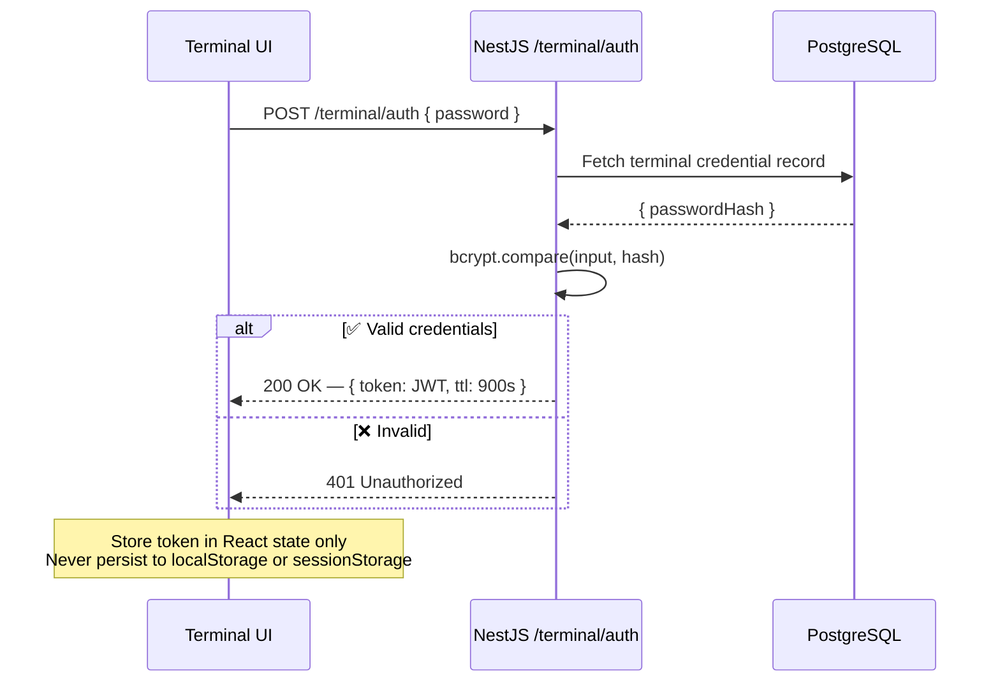
```mermaid
sequenceDiagram
    participant T as Terminal UI
    participant A as NestJS /terminal/auth
    participant DB as PostgreSQL

    T->>A: POST /terminal/auth { password }
    A->>DB: Fetch terminal credential record
    DB-->>A: { passwordHash }
    A->>A: bcrypt.compare(input, hash)

    alt ✅ Valid credentials
        A-->>T: 200 OK — { token: JWT, ttl: 900s }
    else ❌ Invalid
        A-->>T: 401 Unauthorized
    end

    Note over T: Store token in React state only<br/>Never persist to localStorage or sessionStorage
```

JWT tokens must have a short TTL (15 minutes recommended) and must not be persisted to any browser storage.

---

### ⚙️ Environment Variables

```env
# ─── Frontend (.env) ─────────────────────────────────────
# Supabase Cloud Database Integration
VITE_SUPABASE_URL=https://your-project.supabase.co
VITE_SUPABASE_PUBLISHABLE_KEY=your-supabase-publishable-anon-key

# Data Mode Switch (true: Live Supabase DB queries | false: Offline local data)
VITE_USE_BACKEND=true

# Groq Cloud AI Integration (multi-model tool calling + local fallback)
VITE_GROQ_API_KEY=gsk_your_groq_api_key_here

# Optional AI / REST proxy base URL (used when Groq key is absent)
VITE_AI_API_URL=http://localhost:5000/api

# EmailJS Contact Delivery
VITE_EMAILJS_SERVICE_ID=service_id
VITE_EMAILJS_TEMPLATE_ID=template_id
VITE_EMAILJS_PUBLIC_KEY=public_key

# Optional Legacy / REST API Fallback Base URL
VITE_API_URL=http://localhost:5000/api
```

---

### 🔗 Data Layer & Supabase Integration Point

The frontend uses `BaseRepository` (`src/api/core/base.repository.js`) to handle data querying and automatic local fallback:

```javascript
// BaseRepository — Live Supabase Query with Graceful Fallback
async getAll(params = {}) {
  // 1. If VITE_USE_BACKEND is false, instantly serve local domain mock
  if (!this.useBackend && this.localMockData !== null) {
    return Promise.resolve(this.localMockData);
  }

  try {
    // 2. Query Supabase table matching endpoint name
    let query = this.supabase.from(this.endpoint).select('*');
    const { data, error } = await query;
    if (error) throw error;
    
    // 3. Fall back to local mock data if table is empty or unpopulated
    if ((!data || data.length === 0) && this.localMockData !== null) {
      return this.localMockData;
    }
    return data;
  } catch (error) {
    // 4. Catch network/database failures and gracefully recover with mock data
    logger.error(this.endpoint, 'Failed query, using fallback', error);
    return Promise.resolve(this.localMockData);
  }
}
```

This guarantees that:
1. When connected to Supabase (`VITE_USE_BACKEND=true`), changes in Supabase appear immediately.
2. If offline or if database credentials are not configured, the site continues to operate with zero breaking errors.

---

### 🚀 Backend Deployment

| Service | Purpose |
|---------|---------|
| Railway / Render | NestJS API hosting |
| Supabase / Neon | Managed PostgreSQL |
| Netlify | Frontend (completely unchanged) |
| GitHub Actions | CI/CD — test, build, deploy pipeline |

Configure CORS to allow requests only from your Netlify domain:

```typescript
// main.ts
app.enableCors({
  origin: ['https://yourdomain.netlify.app'],
  methods: ['GET', 'POST', 'DELETE'],
  allowedHeaders: ['Content-Type', 'Authorization'],
});
```

---

### ✅ Backend Migration Checklist

- [ ] Initialize NestJS project with TypeORM and PostgreSQL connection
- [ ] Create entities for all 11 domains
- [ ] Write initial migration and seed from existing static data files
- [ ] Implement `terminal/auth` module with JWT guard and bcrypt comparison
- [ ] Move contact delivery to backend with Nodemailer
- [ ] Set `VITE_API_BASE_URL` in frontend `.env`
- [ ] Update `BaseRepository` to route through `apiClient`
- [ ] Add `@UseGuards(JwtAuthGuard)` to terminal logout endpoint
- [ ] Configure CORS for the Netlify production domain
- [ ] Enable Swagger at `/api/docs` for auto-generated API documentation
- [ ] Deploy backend and smoke-test every frontend route against the live API
- [ ] Remove all credential-related data from frontend static files

---

## 🚀 Local Development

### Requirements

| Requirement | Version |
|-------------|---------|
| Node.js | 18+ |
| npm / pnpm | Latest stable |

### Commands

```bash
# Install dependencies
npm install

# Start dev server with HMR
npm run dev

# Production build (must pass cleanly before any deployment)
npm run build
```

The application must produce a clean `npm run build` with zero console errors before any production deployment.

---

## 🌐 Deployment

Deployed on **Netlify**. The `netlify.toml` configuration handles SPA routing (all paths redirect to `index.html`), production build settings, and security headers. Maintain this file whenever routing or build behavior changes.

---

## 📋 Production Rules

Every change to the codebase must follow these rules:

| # | Rule |
|---|------|
| 1 | 🏗️ Preserve **Presentation → Service → Data**. Never bypass a layer. |
| 2 | 🧩 Keep domain logic outside presentation components. |
| 3 | 📦 Keep all portfolio data normalized in its domain files. |
| 4 | ⚙️ Centralize site configuration in `site-config.js`. |
| 5 | 🖥️ All terminal logic stays in the helper layer, accessed via `terminal.service.js`. |
| 6 | 🔐 Protected commands must pass through the authentication gatekeeper. |
| 7 | 🚪 Explicitly clear root privileges on every `logout` and `exit`. |
| 8 | 🚫 Never expose real credentials in frontend source code. |
| 9 | ⚠️ Treat frontend auth as an interactive feature, not real authorization. |
| 10 | 🔌 Keep all external integrations behind service abstractions. |
| 11 | 🔜 Every architectural decision must preserve backend migration compatibility. |
| 12 | 📱 Preserve responsive behavior and accessibility on every change. |
| 13 | 💀 Maintain loading and error states throughout — no blank screens. |
| 14 | ✅ Verify `npm run build` passes cleanly after significant changes. |
| 15 | 📝 Update `README.md` architecture graphs when the AI, helper, or service layers change. |
| 16 | 🤖 Keep AI I/O in `ai.service.js`. Intent routing stays in `ai.router.js`. Typo maps stay in `intentNormalizer.js`. |
| 17 | 🛠️ Keep `ai.tools.js` as the single read-only Groq registry. Do not let the widget or router query domain services directly. |
| 18 | 🎨 Preserve Ego’s card markdown (no tables, no raw JSON dumps) via `ai.config.js` and local fallback formatters. |

---

## 📬 Contact & Links

| Channel | Link |
|---------|------|
| 📧 Email | [rajahaider7896@gmail.com](mailto:rajahaider7896@gmail.com) |
| 💬 WhatsApp | +92 322 5629058 |
| 🐙 GitHub | [Haiderali445](https://github.com/Haiderali445) |
| 💼 LinkedIn | [haider-ali-8a025b290](https://www.linkedin.com/in/haider-ali-8a025b290/) |
| 📸 Instagram | [hayder_alyy__](https://www.instagram.com/hayder_alyy__/) |
| 🌐 Live Site | [haideraliblog.netlify.app](https://haideraliblog.netlify.app/) |

---

## 📜 License

**Personal Use Only.**

You may download, clone, fork, customize, and self-host. Pull requests and public collaboration are not accepted.

---

<div align="center">

**Ego Web** is not a portfolio template. It is an engineering system that demonstrates **how the engineer thinks about software** — and where it's going next.

</div>